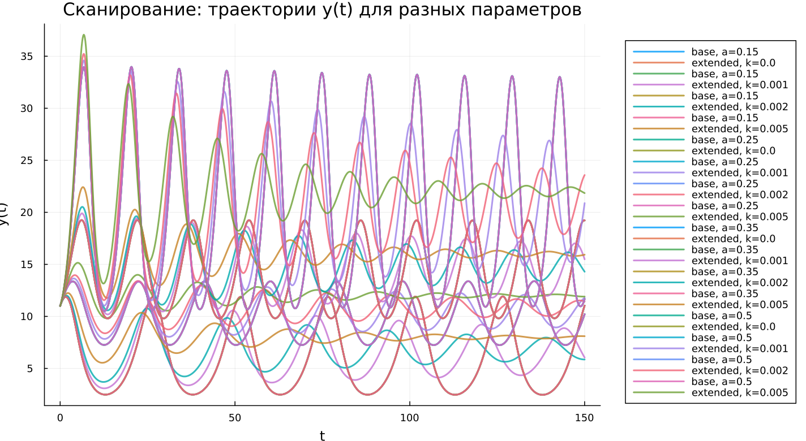

---
## Author
author:
  name: Владимир Базлов
  email: 1132239401@rudn.ru
  affiliation:
    - name: Российский университет дружбы народов
      country: Российская Федерация
      postal-code: 117198
      city: Москва
      address: ул. Миклухо-Маклая, д. 6

## Title
title: "Математическое моделирование"
subtitle: "Лабораторная работа № 5"
license: "CC BY"
date: today
date-format: "YYYY-MM-DD"
---

# Вводная часть

## Цель работы

Проанализировать поведение системы «хищник–жертва» и сравнить её динамику для базовой и модифицированной моделей.

## Задание

1. Построить фазовую зависимость между популяциями.
2. Получить временные зависимости $x(t)$ и $y(t)$.
3. Определить точку равновесия системы.
4. Сопоставить динамику двух моделей.
5. Исследовать влияние параметров.

# Теоретические сведения

## Модель хищник-жертва

Рассматривается система Лотки–Вольтерры, описывающая взаимодействие двух популяций.

Обозначим:

- $x(t)$ — численность хищников;
- $y(t)$ — численность жертв.

Тогда модель задаётся системой:

$$
\begin{cases}
\frac{dx}{dt} = -a x(t) + b x(t) y(t), \\
\frac{dy}{dt} = c y(t) - d x(t) y(t).
\end{cases}
$$

## Интерпретация параметров

Параметры модели определяют характер взаимодействия:

- $a$ — интенсивность убывания хищников;
- $b$ — прирост хищников за счёт взаимодействия;
- $c$ — естественный рост жертв;
- $d$ — уменьшение численности жертв.

Изменение коэффициентов влияет на режим функционирования системы.

## Стационарное состояние

Равновесие достигается при выполнении условий:

$$
\frac{dx}{dt}=0, \qquad \frac{dy}{dt}=0
$$

При положительных значениях переменных получаем:

$$
x_0=\frac{a}{b}, \qquad y_0=\frac{c}{d}
$$

Эта точка соответствует состоянию баланса популяций.

# Постановка задачи

## Исследуемая система

Рассматривается система:

$$
\begin{cases}
\frac{dx}{dt} = -0.25 x(t) + 0.025 x(t) y(t), \\
\frac{dy}{dt} = 0.45 y(t) - 0.045 x(t) y(t).
\end{cases}
$$

## Начальные условия

Начальное состояние задаётся:

$$
x_0 = 8, \qquad y_0 = 11
$$

## Стационарное состояние системы

Подставляя параметры, получаем:

$$
x_0 = 10, \qquad y_0 = 10
$$

Следовательно, равновесная точка системы имеет координаты $(10, 10)$.

# Базовые эксперименты

## Базовая модель: временные зависимости

## Базовая модель: фазовый портрет

## Базовая модель: анализ

В базовом варианте наблюдается устойчивый колебательный процесс.

Характерные черты:

- регулярная периодичность;
- неизменная амплитуда;
- отсутствие перехода к равновесию;
- замкнутые фазовые траектории.

Это указывает на сохранение автоколебательного режима.

## Расширенная модель: временные зависимости

## Расширенная модель: фазовый портрет

## Расширенная модель: анализ

В модифицированной модели динамика становится затухающей.

Особенности поведения:

- первоначально большие колебания;
- постепенное уменьшение амплитуды;
- стремление к устойчивому состоянию;
- спиральные фазовые траектории.

Дополнительный нелинейный член стабилизирует систему.

# Параметрическое исследование

## Сканирование траекторий $x(t)$

## Анализ траекторий $x(t)$

Результаты варьирования параметров:

- в базовой системе изменение $a$ влияет на форму колебаний;
- колебательный режим сохраняется;
- в расширенной модели параметр $k$ регулирует затухание;
- увеличение $k$ ускоряет выход к равновесию.

## Сканирование траекторий $y(t)$

## Анализ траекторий $y(t)$

Поведение аналогично:

- базовая модель сохраняет периодичность;
- расширенная демонстрирует затухание;
- усиление нелинейности ускоряет стабилизацию;
- система стремится к равновесию.

## Фазовые траектории

## Анализ фазовых траекторий

Фазовые портреты показывают различие:

- замкнутые кривые в базовой модели;
- спиральное сжатие в расширенной;
- сохранение автоколебаний в первом случае;
- устойчивое равновесие во втором.

# Анализ итоговой метрики

## Метрика norm_final

Рассматривается величина:

$$
\text{norm\_final} = \sqrt{x(t_{final})^2 + y(t_{final})^2}
$$

## Зависимость norm_final от параметра

## Интерпретация результата

Полученные данные показывают:

- в базовой модели значение остаётся высоким из-за колебаний;
- система не достигает равновесия;
- в расширенной модели метрика определяется устойчивым состоянием;
- после переходного процесса система стабилизируется.

# Анализ вычислений

## Время вычислений

## Интерпретация времени вычислений

Результаты вычислений:

- оба варианта модели считаются быстро;
- затраты времени малы и стабильны;
- параметры почти не влияют на длительность;
- усложнение модели не увеличивает вычислительную сложность.

# Итоги

## Выводы

1. Базовая модель реализует устойчивые незатухающие колебания  
2. Расширенная модель приводит к установлению равновесия  
3. Фазовые портреты отражают различие динамических режимов  
4. Параметры $a$ и $k$ определяют характеристики переходных процессов  
5. Метрика $\text{norm\_final}$ позволяет различать режимы поведения  
6. Численные методы обеспечивают высокую эффективность вычислений  
