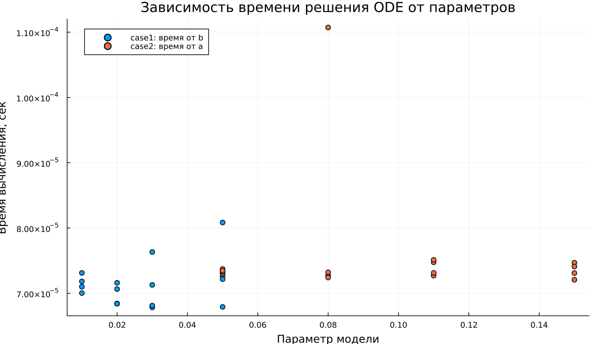

---
author:
  name: Владимир Базлов
  email: 1132239401@rudn.ru
  affiliation:
    - name: Российский университет дружбы народов
      country: Российская Федерация
      city: Москва
title: "Математическое моделирование"
subtitle: "Лабораторная работа № 6"
license: "CC BY"
date: today
date-format: "YYYY-MM-DD"
---

# Вводная часть

## Цель работы

Изучить модель эпидемии SIR и исследовать динамику распространения заболевания.

## Задание

1. Изучить модель эпидемии.
2. Построить графики изменения численности групп $S(t)$, $I(t)$ и $R(t)$.
3. Рассмотреть два случая:
   - $I(0) \leq I^*$;
   - $I(0) > I^*$.
4. Выполнить параметрическое исследование.
5. Сравнить поведение моделей.

# Теоретические сведения

## Модель SIR

В модели SIR популяция делится на три группы:

- $S(t)$ — восприимчивые к болезни;
- $I(t)$ — инфицированные;
- $R(t)$ — выздоровевшие с иммунитетом.

Общая численность популяции:

$$
N = S(t) + I(t) + R(t).
$$

## Смысл модели

Модель описывает переходы между группами:

$$
S \rightarrow I \rightarrow R.
$$

Восприимчивые заражаются и переходят в группу инфицированных, а инфицированные со временем выздоравливают и переходят в группу $R$.

## Условие изоляции

До достижения критического числа заболевших $I^*$ считаем, что инфицированные изолированы.

Если:

$$
I(t) \leq I^*,
$$

то заражение новых восприимчивых не происходит.

Если:

$$
I(t) > I^*,
$$

то инфицированные начинают заражать восприимчивых особей.

## Уравнение для $S(t)$

Скорость изменения числа восприимчивых:

$$
\frac{dS}{dt} =
\begin{cases}
-\alpha S, & I(t) > I^*, \\
0, & I(t) \leq I^*.
\end{cases}
$$

## Уравнение для $I(t)$

Скорость изменения числа инфицированных:

$$
\frac{dI}{dt} =
\begin{cases}
\alpha S - \beta I, & I(t) > I^*, \\
-\beta I, & I(t) \leq I^*.
\end{cases}
$$

## Уравнение для $R(t)$

Скорость изменения числа выздоровевших:

$$
\frac{dR}{dt} = \beta I.
$$

Параметры модели:

- $\alpha$ — коэффициент заражения;
- $\beta$ — коэффициент выздоровления.

# Постановка задачи

## Исходные данные

На острове вспыхнула эпидемия.

Дано:

$$
N = 11400,
$$

$$
I(0) = 250,
$$

$$
R(0) = 47.
$$

## Начальное число восприимчивых

Число восприимчивых в начальный момент времени:

$$
S(0) = N - I(0) - R(0).
$$

Подставим значения:

$$
S(0) = 11400 - 250 - 47 = 11103.
$$

## Рассматриваемые случаи

Исследуются два режима:

1. $I(0) \leq I^*$ — число инфицированных не превышает критическое значение.
2. $I(0) > I^*$ — число инфицированных превышает критическое значение.

# Базовые эксперименты

## Первая модель: временные зависимости

## Первая модель: фазовый портрет

## Анализ первой модели

Для первой модели наблюдается нетипичное поведение:

- $S(t)$ остаётся постоянным;
- $I(t)$ экспоненциально возрастает;
- $R(t)$ убывает и может становиться отрицательным;
- система не имеет механизма стабилизации.

## Вывод по первой модели

Первая модель не соответствует физическому смыслу классической SIR-системы.

Главная проблема:

$$
S(t) = const,
$$

поэтому число восприимчивых не уменьшается, а число инфицированных растёт без ограничения.

# Вторая модель

## Вторая модель: временные зависимости

## Вторая модель: фазовый портрет

## Анализ второй модели

Во второй модели наблюдается типичная эпидемическая динамика:

- $S(t)$ монотонно убывает;
- $I(t)$ сначала возрастает;
- затем $I(t)$ достигает максимума и уменьшается;
- $R(t)$ монотонно возрастает.

## Интерпретация второй модели

Сначала заболевание активно распространяется.

Затем число восприимчивых уменьшается, скорость заражения падает, и эпидемия постепенно затухает:

$$
I(t) \rightarrow 0.
$$

# Сравнение базовых моделей

## Качественное различие

| Характеристика | Первая модель | Вторая модель |
|---|---|---|
| $S(t)$ | постоянно | убывает |
| $I(t)$ | растёт без ограничения | имеет конечный пик |
| $R(t)$ | может быть отрицательным | возрастает |
| Фазовый портрет | вертикальная линия | незамкнутая кривая |
| Физический смысл | нарушен | сохраняется |

# Параметрическое исследование

## Сканирование траекторий $S(t)$

## Анализ траекторий $S(t)$

Для первой модели:

- $S(t)$ не изменяется;
- параметры почти не влияют на динамику восприимчивых.

Для второй модели:

- $S(t)$ убывает;
- при увеличении параметра $a$ убывание происходит быстрее.

## Сканирование траекторий $I(t)$

## Анализ траекторий $I(t)$

Первая модель:

- демонстрирует экспоненциальный рост $I(t)$;
- при увеличении параметра $b$ рост ускоряется.

Вторая модель:

- демонстрирует эпидемическую волну;
- $I(t)$ достигает максимума и затем убывает.

## Сканирование траекторий $R(t)$

## Анализ траекторий $R(t)$

Первая модель:

- приводит к нефизичным значениям $R(t)$;
- возможны отрицательные значения.

Вторая модель:

- показывает накопление выздоровевших;
- $R(t)$ стремится к конечному уровню.

## Фазовые траектории

## Анализ фазовых траекторий

Фазовые портреты подтверждают различие моделей:

- в первой модели траектории вырождаются в вертикальные линии;
- во второй модели траектории имеют характерную SIR-форму;
- сначала наблюдается рост $I$ при уменьшении $S$;
- затем происходит спад $I$.

# Анализ итоговых метрик

## Метрика norm_final

Рассматривалась метрика:

$$
\text{norm\_final} =
\sqrt{
S(t_{final})^2 +
I(t_{final})^2 +
R(t_{final})^2
}.
$$

Она характеризует состояние системы в конце моделирования.

## Зависимость norm_final от параметра

## Интерпретация norm_final

Для первой модели:

- метрика быстро возрастает;
- причина — экспоненциальный рост $I(t)$.

Для второй модели:

- значения меньше;
- система стремится к стационарному состоянию.

# Максимум инфицированных

## Зависимость $I_{max}$ от параметра

## Анализ $I_{max}$

Первая модель:

- даёт крайне большие значения $I_{max}$;
- рост не ограничен.

Вторая модель:

- даёт конечный максимум;
- пик зависит от параметра $a$;
- при большем $a$ пик достигается быстрее.

# Анализ вычислений

## Время вычислений

## Интерпретация времени вычислений

Бенчмаркинг показал:

- обе модели решаются быстро;
- время вычислений имеет порядок $10^{-4}$ секунды;
- изменение параметров почти не влияет на вычислительную сложность;
- численный метод работает эффективно.

# Итоги

## Основные результаты

1. Первая модель демонстрирует нефизичное поведение.
2. В ней число инфицированных растёт без ограничения.
3. Вторая модель описывает реалистичную эпидемическую волну.
4. Во второй модели эпидемия затухает, а $I(t) \to 0$.
5. Фазовые портреты подтверждают качественное различие моделей.

## Выводы

1. Модель case1 не является адекватной для описания эпидемии.
2. Модель case2 соответствует классической логике SIR-процесса.
3. Параметры $a$ и $b$ существенно влияют на скорость распространения инфекции.
4. Метрики $\text{norm\_final}$ и $I_{max}$ позволяют количественно сравнить модели.
5. Численное решение обеих систем выполняется эффективно.

# Список литературы {.unnumbered}

1. [Конструирование эпидемиологических моделей](https://habr.com/ru/post/551682/)
2. [Зараза, гостья наша](https://nplus1.ru/material/2019/12/26/epidemic-math)
