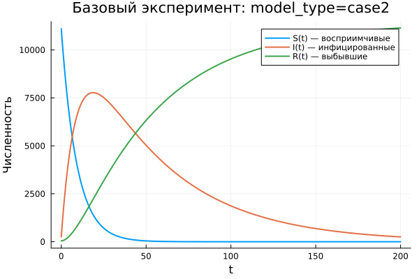

---
## Author
author:
  name: Владимир Базлов
  email: 1132239401@rudn.ru
  affiliation:
    - name: Российский университет дружбы народов
      country: Российская Федерация
      postal-code: 117198
      city: Москва
      address: ул. Миклухо-Маклая, д. 6

## Title
title: "Математическое моделирование"
subtitle: "Лабораторная работа № 6"
license: "CC BY"
---

# Цель работы

Изучить эпидемиологическую модель $SIR$ и проанализировать особенности её поведения при различных начальных условиях.

# Задание

1. Изучить математическую модель распространения эпидемии.
2. Построить графики изменения численности особей в каждой из трёх групп. Проанализировать развитие эпидемии для двух случаев: $I(0)\leq I^*$ и $I(0)>I^*$.

# Выполнение лабораторной работы

## Теоретические сведения

Рассмотрим базовую модель эпидемического процесса. Пусть имеется изолированная популяция численностью $N$. Все особи этой популяции делятся на три группы. К первой группе относятся восприимчивые к заболеванию, но ещё не инфицированные особи. Их количество обозначается через $S(t)$. Вторая группа включает заражённых особей, которые являются источниками распространения инфекции; их численность обозначается как $I(t)$. Третья группа состоит из выздоровевших особей, получивших иммунитет к заболеванию. Их число обозначается через $R(t)$.

Предполагается, что пока количество заболевших не превосходит критический уровень $I^*$, инфицированные изолированы и не передают инфекцию здоровым особям. Если же выполняется условие $I(t)>I^*$, заражённые начинают инфицировать восприимчивых особей.

Следовательно, скорость изменения числа восприимчивых особей $S(t)$ задаётся следующим образом:

$$
\frac{dS}{dt}=
 \begin{cases}
	-\alpha S &\text{,если $I(t) > I^*$}
	\\   
	0 &\text{,если $I(t) \leq I^*$}
 \end{cases}
$$

Так как каждая восприимчивая особь после заражения переходит в группу инфицированных, изменение числа заражённых определяется балансом между вновь заболевшими и теми, кто выбывает из группы инфицированных вследствие лечения. Поэтому для $I(t)$ получаем:

$$
\frac{dI}{dt}=
 \begin{cases}
	\alpha S -\beta I &\text{,если $I(t) > I^*$}
	\\   
	-\beta I &\text{,если $I(t) \leq I^*$}
 \end{cases}
$$

Численность выздоровевших особей, приобретающих иммунитет, изменяется по закону:

$$
\frac{dR}{dt} = \beta I
$$

Параметры $\alpha$ и $\beta$ являются коэффициентами заболеваемости и выздоровления соответственно. Для однозначного определения решения системы необходимо задать начальные условия. Будем считать, что в начальный момент времени $t=0$ заданы значения $S(0)$, $I(0)$ и $R(0)$. Для исследования характера эпидемии требуется рассмотреть два режима: $I(0) \leq I^*$ и $I(0)>I^*$.

### Задача

На острове началась эпидемия. Известно, что общая численность населения острова составляет $N=11400$. В начальный момент времени $(t=0)$ число заболевших людей, способных распространять инфекцию, равно $I(0)=250$, а число людей, уже имеющих иммунитет, равно $R(0)=47$.

Тогда начальное число восприимчивых, но ещё здоровых людей определяется выражением:

$$
S(0)=N-I(0)-R(0)
$$

Необходимо построить графики изменения численности всех трёх групп.

Следует рассмотреть два варианта развития процесса:

1. $I(0)\leq I^*$
2. $I(0)>I^*$

Для численного моделирования и построения графиков были использованы внешние файлы с программным кодом:





## Базовые эксперименты

### Первая модель (model_type = case1)

Для первой модели наблюдается поведение, которое отличается от классической картины эпидемического процесса. Число восприимчивых особей $S(t)$ не изменяется во времени, что полностью соответствует условию $dS/dt = 0$. При этом численность инфицированных $I(t)$ быстро возрастает по экспоненциальному закону, а величина $R(t)$ уменьшается и принимает отрицательные значения.

Такой результат не имеет корректной эпидемиологической интерпретации. В системе отсутствует механизм, ограничивающий рост числа заражённых, а переменная $R(t)$ теряет физический смысл, поскольку количество выздоровевших не может быть отрицательным.

Фазовый портрет также подтверждает выявленную особенность. Траектория почти превращается в вертикальную прямую, так как значение $S$ остаётся неизменным, а динамика происходит только по переменной $I$. Следовательно, система фактически сводится к одномерному процессу.

Таким образом, первая модель описывает неограниченное увеличение числа инфицированных без выхода на устойчивое состояние, поэтому её нельзя считать адекватной моделью распространения заболевания.

### Вторая модель (model_type = case2)

Во второй модели получается поведение, характерное для системы типа $SIR$. Число восприимчивых $S(t)$ постепенно уменьшается, что соответствует процессу заражения. Число инфицированных $I(t)$ сначала растёт, затем достигает максимального значения, после чего начинает снижаться и стремится к нулю. Число выбывших $R(t)$, наоборот, монотонно увеличивается.

Данная динамика хорошо согласуется с представлением об эпидемии в популяции конечного размера. На начальном этапе инфекция активно распространяется, однако по мере сокращения числа восприимчивых скорость новых заражений падает, и эпидемия постепенно затухает.

Фазовый портрет представляет собой незамкнутую кривую. Сначала траектория направлена вверх, что означает рост $I$ при уменьшении $S$, затем она плавно опускается вниз, отражая спад числа инфицированных.

В отличие от первой модели, во втором случае система стремится к стационарному режиму: $I(t) \to 0$, значение $S(t)$ выходит на некоторый остаточный уровень, а $R(t)$ достигает конечного значения.

## Параметрическое сканирование

### Траектории $S(t)$ для различных параметров

Анализ графиков $S(t)$ показывает, что модели по-разному реагируют на изменение параметров. В первой модели (case1) величина $S(t)$ остаётся постоянной для любых значений параметров. Это объясняется тем, что в данной системе выполняется равенство $dS/dt = 0$. Поэтому изменение коэффициентов не влияет на численность восприимчивых особей.

Во второй модели (case2) наблюдается убывание $S(t)$, причём скорость этого убывания зависит от параметра $a$. Чем больше значение $a$, тем быстрее уменьшается число восприимчивых особей, что соответствует более интенсивному распространению инфекции.

Основные результаты:

- в первой модели величина $S(t)$ остаётся неизменной;
- во второй модели $S(t)$ монотонно убывает;
- параметр $a$ задаёт интенсивность снижения числа восприимчивых.

### Траектории $I(t)$ для различных параметров

В первой модели для всех наборов параметров наблюдается экспоненциальный рост числа инфицированных $I(t)$. При увеличении параметра $b$ скорость роста становится значительно выше, из-за чего значения $I(t)$ достигают крайне больших величин.

Во второй модели динамика имеет иной характер. Число инфицированных сначала увеличивается, затем проходит через максимум и начинает снижаться. Параметр $a$ влияет как на высоту пика, так и на момент его достижения: при больших значениях $a$ максимум наступает раньше, а последующее снижение происходит быстрее.

Можно выделить следующие особенности:

- первая модель приводит к неограниченному росту числа инфицированных;
- вторая модель формирует типичную эпидемическую волну;
- параметры определяют скорость и масштаб распространения заболевания.

### Траектории $R(t)$ для различных параметров

Для первой модели характерно уменьшение $R(t)$, причём со временем эта величина становится отрицательной и быстро растёт по модулю. Это указывает на некорректность модели и отсутствие физического смысла у полученной динамики.

Во второй модели, напротив, $R(t)$ монотонно возрастает и постепенно приближается к предельному значению. Параметры влияют на скорость накопления выбывших: при более интенсивном заражении переход особей в группу $R$ происходит быстрее.

Следовательно:

- первая модель даёт нефизичные значения $R(t)$;
- во второй модели происходит естественное накопление выздоровевших;
- параметры определяют скорость достижения насыщения.

### Фазовые траектории для различных параметров

Фазовые портреты позволяют наглядно увидеть качественное различие между моделями.

В первой модели все фазовые траектории вырождаются в вертикальные линии, поскольку переменная $S$ не изменяется. Это означает, что полноценной двумерной динамики в плоскости $(S,I)$ фактически нет.

Во второй модели фазовые траектории имеют форму кривых, характерных для эпидемического процесса. Сначала наблюдается рост $I$ при одновременном уменьшении $S$, затем число инфицированных начинает снижаться, хотя $S$ продолжает уменьшаться.

Таким образом, изменение параметров не меняет принципиального характера моделей:

- первая модель остаётся вырожденной;
- вторая модель сохраняет реалистичную эпидемическую динамику.

### Анализ метрики norm_final

В ходе анализа использовалась метрика

$$
\text{norm\_final} = \sqrt{S(t_{final})^2 + I(t_{final})^2 + R(t_{final})^2}.
$$

Для первой модели значение $\text{norm\_final}$ быстро увеличивается при росте параметра $b$. Это связано с экспоненциальным увеличением $I(t)$ и уменьшением $R(t)$, что приводит к большим значениям нормы итогового состояния.

Для второй модели значения этой метрики заметно меньше и меняются более плавно. Такое поведение объясняется тем, что система выходит к стационарному состоянию, при котором $I(t) \to 0$, а величины $S$ и $R$ остаются конечными.

Итоговые наблюдения:

- в первой модели метрика растёт без ограничения;
- во второй модели она характеризует конечное устойчивое состояние системы.

### Анализ максимального числа инфицированных

Максимальное значение числа инфицированных $I_{max}$ существенно зависит от параметров модели.

В первой модели $I_{max}$ достигает очень больших значений, что объясняется отсутствием ограничивающего механизма. При увеличении параметра $b$ максимум числа заражённых резко возрастает.

Во второй модели $I_{max}$ остаётся конечным и определяется значением параметра $a$. При увеличении $a$ пик наступает быстрее, однако его величина ограничена особенностями динамики системы.

Следовательно:

- первая модель вызывает неограниченный рост $I_{max}$;
- вторая модель описывает контролируемую эпидемическую волну.

### Время вычислений

Результаты бенчмаркинга показывают, что время численного решения во всех проведённых экспериментах остаётся малым и имеет порядок $\sim 10^{-4}$ сек.

Для обеих моделей изменение параметров практически не влияет на вычислительные затраты. Незначительные колебания времени можно связать с особенностями используемого численного метода и адаптивным выбором шага интегрирования.

Можно сделать следующие выводы:

- обе системы эффективно решаются численными методами;
- изменение параметров почти не отражается на вычислительной сложности;
- даже при экспоненциальном росте решений в case1 время расчёта остаётся малым.

## Выводы

1. Первая модель (case1) приводит к неограниченному экспоненциальному росту числа инфицированных при неизменном числе восприимчивых, что указывает на её нефизичность и отсутствие стабилизирующего механизма.
2. Вторая модель (case2) воспроизводит типичную эпидемическую динамику: число инфицированных сначала возрастает, затем уменьшается, а система постепенно переходит к стационарному состоянию.
3. Фазовые портреты подтверждают различие моделей: в первом случае траектория вырождается в вертикальную линию, а во втором формируется полноценная кривая эпидемического процесса.
4. Параметры $a$ и $b$ заметно влияют на динамику: $a$ определяет скорость уменьшения числа восприимчивых, а $b$ влияет на интенсивность изменения числа инфицированных.
5. Метрика $\text{norm\_final}$ позволяет количественно различать модели: в первой она быстро возрастает, а во второй стабилизируется и описывает конечное состояние системы.
6. Максимальное число инфицированных $I_{max}$ в первой модели неограниченно увеличивается, тогда как во второй модели оно остаётся конечным и зависит от выбранных параметров.
7. Численное решение обеих моделей выполняется эффективно, а изменение параметров почти не влияет на время вычислений.

# Список литературы {.unnumbered}

1. [Конструирование эпидемиологических моделей](https://habr.com/ru/post/551682/)
2. [Зараза, гостья наша](https://nplus1.ru/material/2019/12/26/epidemic-math)
