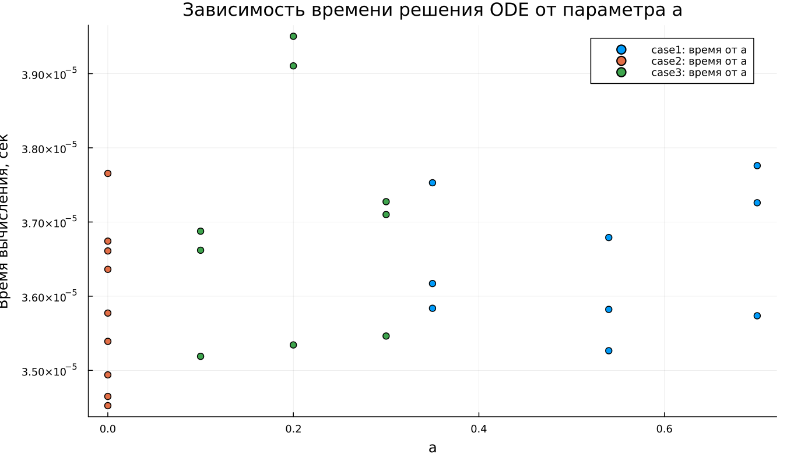

---
author:
  name: Владимир Базлов
  email: 1132239401@rudn.ru
  affiliation:
    - name: Российский университет дружбы народов
      country: Российская Федерация
      city: Москва
title: "Математическое моделирование"
subtitle: "Лабораторная работа №7"
license: "CC BY"
date: today
date-format: "YYYY-MM-DD"
---

# Вводная часть

## Цель работы

Изучить модель эффективности рекламы и исследовать динамику распространения информации о товаре среди потенциальных покупателей.

## Задание

1. Изучить модель эффективности рекламы.
2. Построить графики распространения рекламы для трёх случаев.
3. Исследовать скорость распространения рекламы.
4. Выполнить параметрическое исследование.
5. Сравнить поведение трёх моделей.

# Теоретические сведения

## Модель распространения рекламы

Пусть:

- $N$ — общее число потенциальных покупателей;
- $n(t)$ — число покупателей, знающих о товаре;
- $t$ — время с начала рекламной кампании;
- $\frac{dn}{dt}$ — скорость распространения информации.

## Основная идея модели

Информация о товаре распространяется двумя способами:

1. За счёт рекламной кампании.
2. За счёт общения покупателей между собой.

Общий вид модели:

$$
\frac{dn}{dt} =
(\alpha_1(t) + \alpha_2(t)n(t))(N - n(t)).
$$

## Смысл множителей

Множитель $(N - n(t))$ показывает число покупателей, которые ещё не знают о товаре.

Если $n(t)$ приближается к $N$, то:

$$
N - n(t) \rightarrow 0,
$$

поэтому скорость распространения рекламы уменьшается.

## Уровень насыщения

Значение $N$ является предельным уровнем насыщения:

$$
n(t) \rightarrow N.
$$

При $n = N$ все потенциальные покупатели уже знают о товаре, поэтому дальнейшее распространение информации прекращается.

# Постановка задачи

## Исходные данные

Задано:

$$
N = 609,
$$

$$
n(0) = 4.
$$

Необходимо построить графики $n(t)$ для трёх моделей распространения рекламы.

## Первая модель

$$
\frac{dn}{dt} =
(0.54 + 0.00016n(t))(N - n(t)).
$$

В этой модели рекламное воздействие выражено сильнее, чем вклад общения между покупателями.

## Вторая модель

$$
\frac{dn}{dt} =
(0.000021 + 0.38n(t))(N - n(t)).
$$

Во второй модели основную роль играет распространение информации между уже информированными и неинформированными покупателями.

## Третья модель

$$
\frac{dn}{dt} =
(0.2\cos t + 0.2\cos 2t \cdot n(t))(N - n(t)).
$$

В третьей модели коэффициенты зависят от времени.

# Базовые эксперименты

## Первая модель: динамика $n(t)$

## Первая модель: скорость изменения

## Первая модель: фазовая траектория

## Анализ первой модели

Для первой модели наблюдается монотонный рост $n(t)$.

Основные особенности:

- значение $n(t)$ постепенно приближается к $N = 609$;
- рост наиболее быстрый в начале процесса;
- затем скорость уменьшается;
- решение не превышает уровень насыщения.

## Вывод по первой модели

Первая модель описывает насыщаемый рост.

При приближении к $N$ множитель $(N - n)$ уменьшается, поэтому:

$$
\frac{dn}{dt} \rightarrow 0.
$$

Состояние $n = N$ является равновесным.

# Вторая модель

## Вторая модель: динамика $n(t)$

## Вторая модель: скорость изменения

## Вторая модель: фазовая траектория

## Анализ второй модели

Во второй модели рост происходит значительно быстрее.

График $n(t)$ имеет S-образную форму:

- сначала рост медленный;
- затем скорость резко увеличивается;
- после достижения максимума скорость убывает;
- решение приближается к $N$.

## Максимальная скорость

Во второй модели скорость распространения рекламы имеет выраженный максимум.

Это связано с конкуренцией двух факторов:

- множитель $bn$ ускоряет распространение;
- множитель $(N - n)$ ограничивает рост.

Максимум достигается примерно в средней части диапазона $n$.

# Третья модель

## Третья модель: динамика $n(t)$

## Третья модель: скорость изменения

## Третья модель: фазовая траектория

## Анализ третьей модели

Третья модель также приводит к насыщению.

Особенность модели:

$$
\cos t,\quad \cos 2t.
$$

На выбранном коротком интервале эти функции остаются положительными, поэтому решение не колеблется, а монотонно возрастает.

## Вывод по третьей модели

Третья модель описывает насыщаемый рост с переменными во времени коэффициентами.

Несмотря на наличие тригонометрических функций, общий характер процесса сохраняется:

$$
n(t) \rightarrow N.
$$

# Сравнение базовых моделей

## Качественное различие

| Характеристика | case1 | case2 | case3 |
|---|---|---|---|
| Вид роста | монотонный | S-образный | S-образный |
| Скорость в начале | максимальная | малая | малая |
| Максимум $dn/dt$ | в начале | внутри интервала | внутри интервала |
| Предельное значение | $N$ | $N$ | $N$ |
| Коэффициенты | постоянные | постоянные | зависят от времени |

## Общая особенность

Во всех трёх моделях присутствует множитель:

$$
N - n(t).
$$

Именно он обеспечивает насыщение и не позволяет решению неограниченно возрастать.

# Параметрическое исследование

## Зависимость $n_{final}$ от параметра $a$

## Анализ зависимости $n_{final}(a)$

Большинство точек находится около уровня $N = 609$.

Это означает, что при большинстве наборов параметров система успевает выйти на насыщение.

Исключение наблюдается во второй модели при малом значении параметра $a$.

## Зависимость $n_{final}$ от параметра $b$

## Анализ зависимости $n_{final}(b)$

Параметр $b$ влияет на вклад общения между покупателями.

При больших значениях $b$ распространение рекламы происходит быстрее.

При недостаточном значении параметра система может не успеть достичь уровня насыщения за заданное время.

# Максимальные значения

## Зависимость $n_{max}$ от параметра $a$

## Зависимость $n_{max}$ от параметра $b$

## Анализ $n_{max}$

Так как решения во всех базовых экспериментах монотонно возрастают, величина $n_{max}$ практически совпадает с $n_{final}$.

Если модель достигает насыщения, то:

$$
n_{max} \approx N.
$$

Если времени моделирования недостаточно, то $n_{max}$ оказывается ниже $N$.

# Финальное насыщение

## Зависимость насыщения от параметра $a$

## Зависимость насыщения от параметра $b$

## Метрика насыщения

Использовалась метрика:

$$
\text{saturation\_final} =
\frac{n_{final}}{N}.
$$

Если значение близко к $1$, то система почти полностью достигла уровня насыщения.

## Интерпретация насыщения

Для большинства экспериментов:

$$
\frac{n_{final}}{N} \approx 1.
$$

Это означает почти полный охват аудитории.

Пониженные значения показывают, что процесс распространения рекламы ещё не завершился.

# Бенчмаркинг

## Время решения от параметра $a$

## Время решения от параметра $b$

## Анализ времени вычислений

Бенчмаркинг показал:

- все три модели решаются быстро;
- время вычислений имеет порядок $10^{-5}$ секунды;
- изменение параметров почти не влияет на вычислительную сложность;
- третья модель немного сложнее из-за функций $\cos t$ и $\cos 2t$.

# Итоги

## Основные результаты

1. Все три модели описывают насыщаемый рост.
2. Предельным уровнем является $N = 609$.
3. Первая модель имеет максимальную скорость в начальный момент.
4. Вторая модель демонстрирует наиболее резкий S-образный рост.
5. Третья модель учитывает зависимость коэффициентов от времени.

## Выводы

1. Первая модель (case1) описывает монотонное приближение $n(t)$ к уровню $N$.

2. Вторая модель (case2) демонстрирует S-образный рост и имеет внутренний максимум скорости распространения рекламы.

3. Третья модель (case3) также приводит к насыщению, но использует переменные во времени коэффициенты.

4. Параметры $a$ и $b$ влияют прежде всего на скорость выхода к насыщению.

5. Метрики $n_{final}$, $n_{max}$ и $\text{saturation\_final}$ позволяют количественно сравнить модели.

6. Численное решение всех трёх моделей выполняется эффективно.

# Список литературы {.unnumbered}

1. [Модель Мальтуса](http://km.mmf.bsu.by/courses/2018/mathmod1/MM_LB1_Population_2019.pdf)
2. [Логистическая модель роста](https://studopedia.ru/29_5129_logisticheskaya-model-rosta.html)
