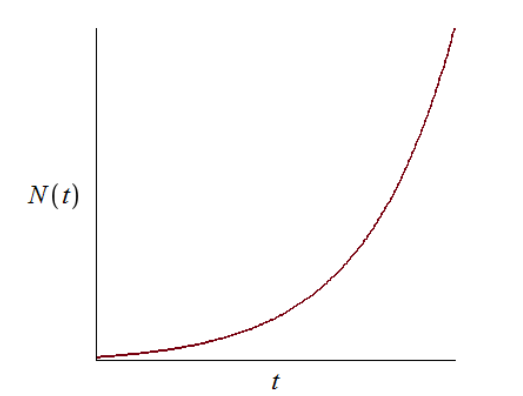
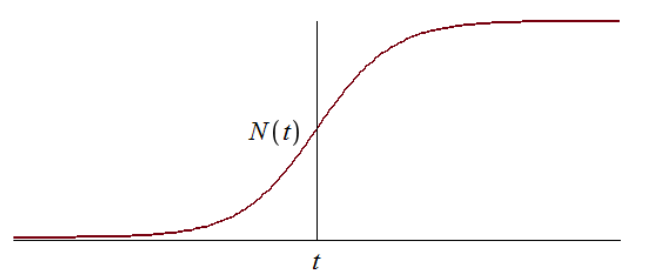
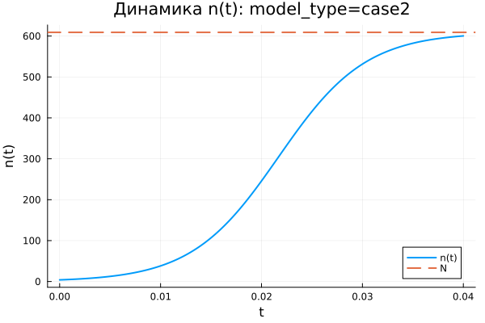
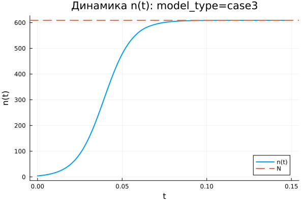
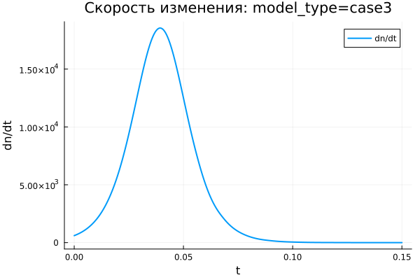
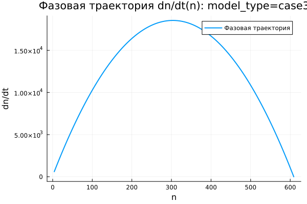

---
## Author
author:
  name: Владимир Базлов
  email: 1132239401@rudn.ru
  affiliation:
    - name: Российский университет дружбы народов
      country: Российская Федерация
      postal-code: 117198
      city: Москва
      address: ул. Миклухо-Маклая, д. 6

## Title
title: "Математическое моделирование"
subtitle: "Лабораторная работа № 7"
license: "CC BY"
---

# Цель работы

Изучить модель эффективности рекламы

# Задание

1.	Изучить модель эфеективности рекламы
2.	Построить графики распространения рекламы в заданных случайх
3.	Определить для случая 2 момент времени, в который скорость распространения рекламы будет максимальной

# Выполнение лабораторной работы

## Теоретические сведения

Организуется рекламная кампания нового товара или услуги. Необходимо, чтобы прибыль будущих продаж с избытком покрывала издержки на рекламу. Вначале расходы могут превышать прибыль, поскольку лишь малая часть потенциальных покупателей будет информирована о новинке. Затем, при увеличении числа продаж, возрастает и прибыль, и, наконец, наступит момент, когда рынок насытиться, и рекламировать товар станет бесполезным.

Предположим, что торговыми учреждениями реализуется некоторая продукция, о которой в момент времени $t$ из числа потенциальных покупателей $N$ знает лишь $n$ покупателей. Для ускорения сбыта продукции запускается реклама по радио, телевидению и других средств массовой информации. После запуска рекламной кампании информация о продукции начнет распространяться среди потенциальных покупателей путем общения друг с другом. Таким образом, после запуска рекламных объявлений скорость изменения числа знающих о продукции людей пропорциональна как числу знающих о товаре покупателей, так и числу покупателей о нем не знающих

Модель рекламной кампании описывается следующими величинами.
Считаем, что $\frac{dn}{dt}$ - скорость изменения со временем числа потребителей, узнавших о товаре и готовых его купить,
$t$ - время, прошедшее с начала рекламной кампании,
$N$ - общее число потенциальных платежеспособных покупателей,
$n(t)$ - число  уже информированных клиентов.
Эта величина пропорциональна числу покупателей, еще не знающих о нем, это описывается следующим образом
$\alpha _1(t)(N-n(t))$, где $\alpha _1>0$ -  характеризует интенсивность рекламной кампании (зависит от затрат на рекламу в данный момент времени).
Помимо этого, узнавшие о товаре потребители также распространяют полученную информацию среди потенциальных покупателей, не знающих о нем (в этом случае работает т.н. сарафанное радио). Этот вклад в рекламу описывается величиной  $\alpha _2(t)n(t)(N-n(t))$. эта величина увеличивается с увеличением потребителей узнавших о товаре.

Математическая модель распространения рекламы описывается уравнением:

$$\frac{dn}{dt} = (\alpha _1(t) + \alpha _2(t)n(t))(N-n(t))$$

При $\alpha _1(t) >> \alpha _2(t)$ получается модель типа модели Мальтуса, решение которой имеет вид 

{ #fig:001 width=70% height=70% }

В обратном случае $\alpha _1(t) << \alpha _2(t)$ получаем уравнение логистической кривой

{ #fig:002 width=70% height=70% }

## Задача

Постройте график распространения рекламы, математическая модель которой описывается следующим уравнением:

1.	$\frac{dn}{dt} = (0.54 + 0.00016n(t))(N-n(t))$
2.	$\frac{dn}{dt} = (0.000021 + 0.38n(t))(N-n(t))$
3.	$\frac{dn}{dt} = (0.2*\cos{t} + 0.2\cos{2t}n(t))(N-n(t))$

При этом объем аудитории $N = 609$, в начальный момент о товаре знает 4 человек.

Для случая 2 определите в какой момент времени скорость распространения рекламы будет иметь максимальное значение.

Для моделирования процесса и построения графиков использовались внешние файлы с программным кодом:





## Базовые эксперименты

### Первая модель (model_type = case1)

Для первой модели наблюдается монотонный рост величины $n(t)$. В начальный момент значение $n$ мало по сравнению с предельным уровнем $N = 609$, поэтому процесс развивается достаточно быстро. Затем по мере приближения $n(t)$ к $N$ рост постепенно замедляется.

На графике динамики видно, что к концу расчётного интервала $t \in [0; 10]$ решение почти достигает уровня насыщения. Горизонтальная пунктирная линия соответствует значению $N$, к которому стремится численное решение. Переменная $n(t)$ не превышает предельный уровень, а плавно приближается к нему снизу.

График скорости изменения показывает, что максимальная скорость наблюдается в начальный момент времени. Далее $dn/dt$ монотонно убывает и стремится к нулю. Это означает, что основной прирост происходит в начале процесса, после чего система постепенно переходит к состоянию насыщения.

Фазовая траектория $dn/dt(n)$ подтверждает данный вывод. При малых значениях $n$ скорость изменения максимальна, а при приближении к $N$ она уменьшается почти до нуля. Траектория имеет убывающий вид, поэтому модель описывает процесс с быстрым начальным ростом и дальнейшим замедлением.

Первая модель демонстрирует устойчивое стремление к предельному уровню $N$. Состояние $n = N$ выступает равновесным: при достижении насыщения множитель $(N - n)$ обращает правую часть уравнения в ноль.

### Вторая модель (model_type = case2)

Во второй модели величина $n(t)$ возрастает значительно быстрее, чем в первой. Расчётный интервал очень мал: $t \in [0; 0{,}04]$, однако за это время решение почти достигает уровня $N = 609$. Это связано с большим значением коэффициента $b$, который усиливает вклад слагаемого $b n$.

График $n(t)$ имеет выраженную S-образную форму. В начале рост сравнительно медленный, поскольку значение $n$ ещё невелико. Затем скорость резко увеличивается, после чего снова снижается при приближении к предельному уровню $N$. В результате решение быстро выходит на насыщение.

График $dn/dt$ показывает наличие одного выраженного максимума. Сначала скорость изменения возрастает, достигает пика примерно в середине активной фазы процесса, а затем убывает почти до нуля. Это означает, что модель описывает режим ускоренного роста с последующим торможением из-за ограничения $(N - n)$.

Фазовая траектория $dn/dt(n)$ имеет форму параболы. При малых значениях $n$ скорость изменения невелика, затем она увеличивается и достигает максимума примерно при $n \approx 300$, после чего снижается при движении к $N$. Это отражает конкуренцию двух факторов: самоускорения через множитель $b n$ и ограничения через множитель $(N - n)$.

Вторая модель описывает более резкий переход к насыщению. В отличие от первой модели, максимальная скорость достигается не в начале, а на внутреннем участке траектории, где значение $n$ уже достаточно велико, но запас до $N$ ещё остаётся существенным.

### Третья модель (model_type = case3)

В третьей модели величина $n(t)$ монотонно возрастает и быстро приближается к уровню $N = 609$. На графике видно, что основная часть роста происходит на начальном участке интервала $t \in [0; 0{,}15]$. После этого кривая почти сливается с горизонтальным уровнем насыщения.

Особенность третьей модели состоит в наличии периодических множителей $\cos(t)$ и $\cos(2t)$. На выбранном коротком интервале времени эти функции остаются положительными и близкими к единице, поэтому они не вызывают колебаний решения, а лишь изменяют интенсивность роста.

График скорости $dn/dt$ имеет один ярко выраженный пик. В начале процесса скорость возрастает, затем достигает максимального значения, после чего быстро убывает к нулю. После выхода $n(t)$ на уровень насыщения дальнейшее изменение практически прекращается.

Фазовая траектория $dn/dt(n)$ по форме близка к параболической. Скорость изменения мала при небольших значениях $n$, затем возрастает и достигает максимума примерно в средней части диапазона. При приближении к $N$ множитель $(N - n)$ уменьшает скорость до нуля.

Третья модель демонстрирует насыщаемый рост с переменными во времени коэффициентами. На данном интервале периодические множители не меняют общий характер процесса: решение остаётся монотонным, достигает предельного уровня и переходит в состояние равновесия.

## Сравнение базовых экспериментов

Во всех трёх моделях величина $n(t)$ стремится к одному и тому же предельному уровню $N = 609$. Это связано с наличием множителя $(N - n)$, который уменьшает скорость роста при приближении к насыщению и обращает её в ноль при $n = N$.

Первая модель отличается быстрым стартом и дальнейшим плавным замедлением. Максимальная скорость наблюдается в начале процесса, а фазовая траектория имеет убывающий характер.

Вторая модель показывает наиболее резкий S-образный рост. Скорость сначала увеличивается, затем достигает максимума и убывает. Фазовая траектория имеет выраженную параболическую форму, что указывает на наличие внутренней точки максимального роста.

Третья модель по характеру близка ко второй, но включает зависимость коэффициентов от времени. На рассматриваемом интервале эта зависимость не приводит к колебательному режиму, поскольку значения $\cos(t)$ и $\cos(2t)$ остаются положительными.

Все три модели приводят систему к насыщению, но делают это с разной скоростью и с разным характером изменения производной $dn/dt$.

## Параметрическое сканирование

### Зависимость итогового значения $n$ от параметра $a$

На графике показана зависимость итогового значения $n_{final}$ от параметра $a$ для трёх моделей. Большинство точек располагается вблизи уровня $N = 609$, что указывает на достижение почти полного насыщения к концу расчётного интервала.

Для первой модели значения $n_{final}$ близки к $N$ при всех рассмотренных значениях параметра $a$. Это означает, что изменение $a$ в выбранном диапазоне не нарушает общий характер процесса: решение продолжает стремиться к предельному уровню.

Во второй модели наблюдается один заметный выброс при малом значении $a$. В этом случае итоговое значение $n$ оказывается существенно ниже $N$ и находится примерно на уровне $n_{final} \approx 455$. Это связано с тем, что при выбранной комбинации параметров процесс не успевает выйти на насыщение за короткий временной интервал.

Для третьей модели значения $n_{final}$ также находятся в верхней части графика и близки к $N$. Наличие периодических коэффициентов не приводит к заметному снижению итогового уровня при выбранных параметрах.

В целом параметр $a$ влияет не только на итоговое значение, но и на скорость выхода к насыщению. Если интенсивность роста мала, система может не успеть достичь уровня $N$ за заданное время моделирования.

### Зависимость итогового значения $n$ от параметра $b$

График зависимости $n_{final}$ от параметра $b$ показывает, что для большей части экспериментов итоговое значение также располагается около $N = 609$. Это подтверждает устойчивое стремление решений к насыщению.

Для первой модели точки сгруппированы около малых значений $b$, поскольку в параметрическом сканировании для этой модели использовались малые значения коэффициента. Несмотря на это, итоговые значения $n$ остаются близкими к предельному уровню.

Во второй модели влияние параметра $b$ выражено сильнее. При одном из значений $b$ итоговое значение $n$ заметно ниже уровня насыщения. Это означает, что для данной комбинации параметров рост оказывается недостаточно быстрым, и система не успевает приблизиться к $N$ за расчётное время.

Для третьей модели точки находятся около $N$, что говорит о сохранении режима насыщаемого роста. Даже при наличии множителей $\cos(t)$ и $\cos(2t)$ итоговое значение остаётся близким к верхнему пределу.

График показывает, что параметр $b$ играет ключевую роль в моделях с нелинейным усилением роста через слагаемое $b n$. При недостаточном значении коэффициента выход на насыщение может замедляться.

### Зависимость максимального значения $n$ от параметра $a$

На графике представлена зависимость максимального значения $n_{max}$ от параметра $a$. Поскольку во всех базовых экспериментах функция $n(t)$ возрастает монотонно, величина $n_{max}$ практически совпадает с итоговым значением $n_{final}$.

Для первой модели максимальные значения находятся около уровня $N = 609$. Это показывает, что решение достигает верхней границы или подходит к ней достаточно близко.

Во второй модели снова выделяется точка с меньшим значением $n_{max}$. Это означает, что на всём временном интервале решение не смогло приблизиться к насыщению. Причина связана не с изменением направления динамики, а с недостаточной скоростью роста на заданном интервале времени.

Для третьей модели максимальные значения сохраняются около $N$. Следовательно, переменные во времени коэффициенты не препятствуют достижению высокого уровня $n$ при выбранном диапазоне параметров.

Поскольку $n_{max}$ отражает наибольшее значение решения за время расчёта, данный график подтверждает выводы, полученные при анализе $n_{final}$.

### Зависимость максимального значения $n$ от параметра $b$

График зависимости $n_{max}$ от параметра $b$ имеет структуру, близкую к графику $n_{final}(b)$. Это связано с монотонным ростом решений: максимум достигается в конце расчётного интервала или вблизи него.

Для первой модели значения $n_{max}$ сосредоточены около $N$. Изменение параметра $b$ в малом диапазоне не приводит к существенному снижению максимального уровня.

Во второй модели одна точка располагается значительно ниже остальных. Это показывает, что при соответствующей комбинации параметров модель не выходит на насыщение. Остальные эксперименты для второй модели дают значения около верхнего предела.

Для третьей модели все точки остаются вблизи $N$, что говорит о стабильном достижении насыщения. Параметр $b$ влияет на скорость роста, но в выбранных экспериментах не меняет конечный характер динамики.

График подтверждает, что максимальный уровень $n$ в первую очередь ограничивается величиной $N$, а параметры $a$ и $b$ определяют скорость приближения к этому пределу.

### Зависимость финального насыщения от параметра $a$

На графике показана зависимость относительного итогового насыщения $n_{final}/N$ от параметра $a$. Значение, близкое к $1$, означает почти полное достижение предельного уровня $N$.

Для первой модели насыщение находится около $1$ при всех рассмотренных значениях $a$. Это показывает, что модель стабильно достигает предельного состояния.

Во второй модели наблюдается одна точка с насыщением около $0{,}75$. Это означает, что при данной комбинации параметров итоговое значение составляет примерно три четверти от возможного максимума. Остальные точки располагаются значительно выше и находятся близко к полному насыщению.

Для третьей модели значения $n_{final}/N$ находятся вблизи $1$. Это указывает на достижение почти полного насыщения даже при наличии временной зависимости коэффициентов.

График удобен для сравнения моделей, поскольку нормировка на $N$ позволяет оценивать не абсолютное значение $n$, а степень приближения к верхнему пределу.

### Зависимость финального насыщения от параметра $b$

График зависимости $n_{final}/N$ от параметра $b$ показывает, что большинство экспериментов завершается почти полным насыщением. Значения расположены вблизи $1$, что соответствует достижению уровня $N$.

Для первой модели насыщение остаётся высоким при всех рассмотренных значениях $b$. Это означает, что даже малые значения параметра не мешают решению приблизиться к предельному уровню за выбранное время.

Во второй модели снова наблюдается одно пониженное значение. В этом эксперименте система достигает только около $75\%$ от уровня $N$. Данный результат показывает чувствительность второй модели к сочетанию параметров и длине расчётного интервала.

Для третьей модели точки располагаются вблизи полного насыщения. Временные множители не создают заметного снижения итогового уровня.

В целом график подтверждает, что система стремится к насыщению, однако при отдельных наборах параметров время моделирования может оказаться недостаточным для выхода на уровень $N$.

## Бенчмаркинг

### Зависимость времени решения ODE от параметра $a$

На графике показано медианное время численного решения задачи ОДУ при различных значениях параметра $a$. Время вычислений находится примерно в диапазоне от $3{,}45 \cdot 10^{-5}$ до $3{,}95 \cdot 10^{-5}$ секунды.

Для всех трёх моделей значения времени близки друг к другу. Это означает, что рассматриваемые задачи имеют малую вычислительную сложность, а изменение параметров не приводит к резкому росту затрат на интегрирование.

Явной монотонной зависимости времени решения от параметра $a$ не наблюдается. Точки располагаются с небольшим разбросом, который может быть связан с особенностями работы численного метода, кэшированием, системной нагрузкой и погрешностью измерения при малых временах выполнения.

Третья модель в отдельных точках показывает немного большее время решения. Это можно объяснить более сложной правой частью уравнения, где дополнительно вычисляются функции $\cos(t)$ и $\cos(2t)$.

В целом бенчмаркинг показывает, что все три модели решаются быстро, а различия между ними по времени вычислений остаются небольшими.

### Зависимость времени решения ODE от параметра $b$

На графике представлена зависимость времени решения ОДУ от параметра $b$. Как и в случае с параметром $a$, значения времени находятся в узком диапазоне порядка $10^{-5}$ секунды.

Для первой модели точки сосредоточены около малых значений $b$, что соответствует выбранной сетке параметров. Время решения немного колеблется, но не демонстрирует устойчивого роста или убывания.

Для второй модели значения времени также изменяются с небольшим разбросом. Даже при увеличении $b$ вычислительные затраты не возрастают существенно. Это говорит о том, что выбранный решатель справляется с задачей без заметного усложнения интегрирования.

Для третьей модели часть точек располагается выше, чем у первых двух моделей. Вероятная причина состоит в более сложной формуле правой части, содержащей тригонометрические множители. При этом различие остаётся небольшим и не меняет общий вывод о высокой скорости расчёта.

График показывает, что параметр $b$ влияет на динамику решения сильнее, чем на время вычислений. В рамках проведённого сканирования вычислительная стоимость остаётся стабильной для всех трёх моделей.

## Выводы

1. Первая модель (case1) описывает насыщаемый рост величины $n(t)$. Решение монотонно возрастает и постепенно приближается к предельному уровню $N = 609$, не превышая его.

2. Во второй модели (case2) наблюдается наиболее резкий рост. Функция $n(t)$ имеет выраженную S-образную форму: сначала рост происходит медленно, затем ускоряется, после чего замедляется при приближении к уровню насыщения.

3. Третья модель (case3) также приводит систему к насыщению, но отличается наличием переменных во времени коэффициентов $\cos(t)$ и $\cos(2t)$. На выбранном интервале они не вызывают колебаний, поэтому решение остаётся монотонным.

4. Во всех трёх моделях предельное значение $N$ играет роль уровня насыщения. При приближении $n(t)$ к $N$ множитель $(N - n)$ уменьшает скорость роста, а при $n = N$ правая часть уравнения обращается в ноль.

5. Графики скорости изменения $dn/dt$ показывают различие между моделями. В первой модели скорость максимальна в начальный момент и затем монотонно убывает. Во второй и третьей моделях скорость сначала возрастает, достигает максимума, а затем снижается почти до нуля.

6. Фазовые траектории $dn/dt(n)$ подтверждают характер динамики. Для первой модели траектория имеет убывающий вид, а для второй и третьей моделей — форму, близкую к параболической, с внутренней точкой максимальной скорости роста.

7. Параметры $a$ и $b$ влияют прежде всего на скорость выхода к насыщению. При достаточно больших значениях параметров система быстро достигает уровня $N$, а при отдельных комбинациях параметров, особенно во второй модели, решение не успевает полностью выйти на насыщение за заданное время.

8. Метрики $n_{final}$ и $n_{max}$ в большинстве экспериментов близки к $N = 609$, что указывает на достижение предельного состояния. Заметные отклонения связаны не с изменением направления динамики, а с недостаточной длительностью расчётного интервала для некоторых наборов параметров.

9. Метрика $\text{saturation\_final} = n_{final}/N$ позволяет оценить степень достижения насыщения. Значения, близкие к единице, показывают почти полный выход системы на предельный уровень, а пониженные значения указывают на незавершённый переходный процесс.

10. Бенчмаркинг показал, что численное решение всех трёх моделей выполняется быстро. Время вычислений находится порядка $10^{-5}$ секунды, а изменение параметров $a$ и $b$ практически не влияет на вычислительные затраты.

11. Третья модель немного сложнее с вычислительной точки зрения, поскольку правая часть содержит тригонометрические функции. Однако разница во времени решения остаётся небольшой и не оказывает существенного влияния на общую эффективность расчётов.

12. В целом все три модели описывают процесс насыщаемого роста, но различаются скоростью перехода к предельному состоянию и формой зависимости $dn/dt$ от времени и от значения $n$.

# Список литературы {.unnumbered}

1. [Модель Мальтуса](http://km.mmf.bsu.by/courses/2018/mathmod1/MM_LB1_Population_2019.pdf)
2. [Логистическая модель роста](https://studopedia.ru/29_5129_logisticheskaya-model-rosta.html)
