---
author:
  name: Владимир Базлов
  email: 1132239401@rudn.ru
  affiliation:
    - name: Российский университет дружбы народов
      country: Российская Федерация
      city: Москва
title: "Математическое моделирование"
subtitle: "Лабораторная работа №8"
license: "CC BY"
date: today
date-format: "YYYY-MM-DD"
---

# Вводная часть

## Цель работы

Изучить модель конкуренции двух фирм и исследовать динамику изменения объёмов продаж в двух случаях:

1. конкуренция только рыночными методами;
2. конкуренция с учётом социально-психологического фактора.

## Задание

1. Изучить модель конкуренции двух фирм.
2. Решить систему дифференциальных уравнений для двух случаев.
3. Построить графики $M_1(t)$ и $M_2(t)$.
4. Исследовать скорости изменения $dM_1/dt$ и $dM_2/dt$.
5. Выполнить параметрическое сканирование.
6. Сравнить результаты двух моделей.

# Теоретические сведения

## Экономический смысл модели

Рассматриваются две фирмы, производящие взаимозаменяемые товары одинакового качества.

Обозначения:

- $M_1(t)$ — объём продаж первой фирмы;
- $M_2(t)$ — объём продаж второй фирмы;
- $\tau_1$, $\tau_2$ — длительности производственных циклов;
- $\widetilde{p}_1$, $\widetilde{p}_2$ — себестоимости продукции;
- $p_{cr}$ — критическая цена товара;
- $N$ — число потребителей;
- $q$ — максимальная потребность одного потребителя.

## Идея модели

Фирмы конкурируют за одну рыночную нишу.

В первой модели конкуренция происходит только рыночными методами.

Во второй модели дополнительно учитывается социально-психологическое влияние, которое усиливает позиции одной из фирм.

# Постановка задачи

## Первая модель

В первом случае динамика объёмов продаж описывается системой:

$$
\frac{dM_1}{d\Theta}
=
M_1
-
\frac{b}{c_1}M_1M_2
-
\frac{a_1}{c_1}M_1^2.
$$

$$
\frac{dM_2}{d\Theta}
=
\frac{c_2}{c_1}M_2
-
\frac{b}{c_1}M_1M_2
-
\frac{a_2}{c_1}M_2^2.
$$

## Вторая модель

Во втором случае в первое уравнение добавляется социально-психологический фактор $d$:

$$
\frac{dM_1}{d\Theta}
=
M_1
-
\left(\frac{b}{c_1} + d\right)M_1M_2
-
\frac{a_1}{c_1}M_1^2.
$$

$$
\frac{dM_2}{d\Theta}
=
\frac{c_2}{c_1}M_2
-
\frac{b}{c_1}M_1M_2
-
\frac{a_2}{c_1}M_2^2.
$$

## Коэффициенты модели

$$
a_1 =
\frac{p_{cr}}
{\tau_1^2 \widetilde{p}_1^2 Nq}.
$$

$$
a_2 =
\frac{p_{cr}}
{\tau_2^2 \widetilde{p}_2^2 Nq}.
$$

$$
b =
\frac{p_{cr}}
{\tau_1^2 \widetilde{p}_1^2 \tau_2^2 \widetilde{p}_2^2 Nq}.
$$

$$
c_1 =
\frac{p_{cr} - \widetilde{p}_1}
{\tau_1 \widetilde{p}_1}.
$$

$$
c_2 =
\frac{p_{cr} - \widetilde{p}_2}
{\tau_2 \widetilde{p}_2}.
$$

## Исходные данные

Начальные условия:

$$
M_1(0) = 3.3,
\qquad
M_2(0) = 2.2.
$$

Параметры:

$$
p_{cr} = 26,
\qquad
N = 33,
\qquad
q = 1.
$$

$$
\tau_1 = 25,
\qquad
\tau_2 = 14.
$$

$$
\widetilde{p}_1 = 5.5,
\qquad
\widetilde{p}_2 = 11.
$$

Для второй модели:

$$
d = 0.00033.
$$

# Базовые эксперименты

## Первая модель: динамика $M_1(t)$ и $M_2(t)$

## Анализ первой модели

В первой модели обе фирмы увеличивают объёмы продаж.

Основные особенности:

- $M_1(t)$ начинает быстро расти раньше, чем $M_2(t)$;
- первая фирма раньше выходит на высокий уровень продаж;
- $M_2(t)$ растёт медленнее и позже входит в активную фазу;
- к концу расчёта первая фирма сохраняет больший объём продаж.

## Первая модель: скорость изменения

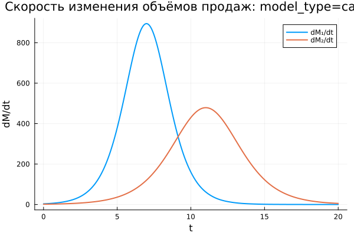

## Анализ скорости в первой модели

Скорость $dM_1/dt$ достигает максимума раньше, чем $dM_2/dt$.

Это означает, что первая фирма быстрее занимает рыночную нишу.

После достижения максимума обе скорости уменьшаются:

$$
\frac{dM_1}{dt} \rightarrow 0,
\qquad
\frac{dM_2}{dt} \rightarrow 0.
$$

Это соответствует выходу обеих фирм на насыщение.

## Первая модель: разность объёмов

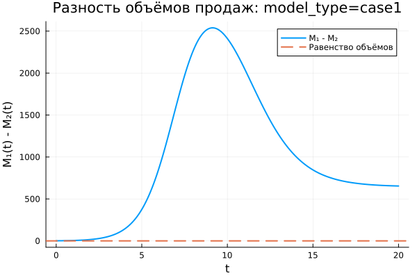

## Итог по первой модели

Разность $M_1(t) - M_2(t)$ остаётся положительной на всём интервале.

Это означает:

$$
M_1(t) > M_2(t).
$$

Первая фирма сохраняет лидерство до конца моделирования.

## Первая модель: фазовая траектория

## Фазовая траектория первой модели

Фазовая траектория $M_2(M_1)$ имеет монотонный характер.

Рост $M_1$ сопровождается ростом $M_2$.

В первой модели конкуренция ограничивает рост, но не приводит к падению объёмов продаж одной из фирм.

# Вторая модель

## Вторая модель: динамика $M_1(t)$ и $M_2(t)$

## Анализ второй модели

Во второй модели учитывается дополнительный фактор $d$.

В начале процесса первая фирма растёт быстрее.

Затем $M_1(t)$ достигает максимума и начинает снижаться.

Вторая фирма продолжает расти, поэтому после некоторого момента:

$$
M_2(t) > M_1(t).
$$

## Вторая модель: скорость изменения

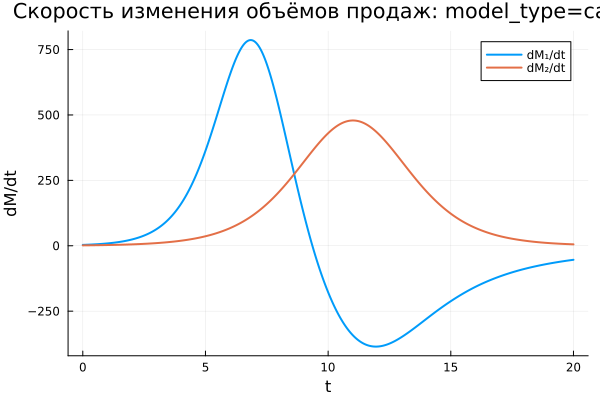

## Анализ скорости во второй модели

Производная $dM_1/dt$ сначала положительна, затем становится отрицательной.

Это означает, что объём продаж первой фирмы после максимума уменьшается:

$$
\frac{dM_1}{dt} < 0.
$$

Производная $dM_2/dt$ остаётся положительной, поэтому вторая фирма продолжает увеличивать продажи.

## Вторая модель: разность объёмов

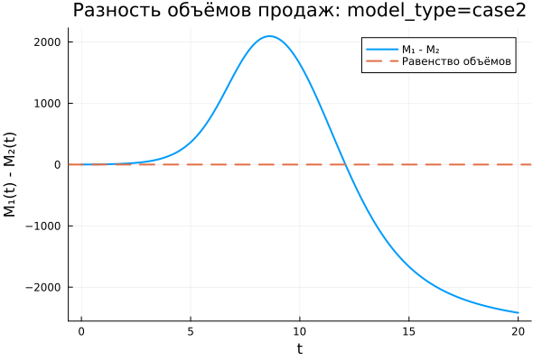

## Смена лидера

Разность $M_1(t) - M_2(t)$ сначала положительна.

Затем график пересекает линию равенства:

$$
M_1(t) = M_2(t).
$$

После этого разность становится отрицательной:

$$
M_1(t) - M_2(t) < 0.
$$

Это означает переход лидерства ко второй фирме.

## Вторая модель: фазовая траектория

## Фазовая траектория второй модели

Фазовая траектория имеет петлеобразный вид.

В начале обе фирмы растут.

Затем $M_1$ начинает уменьшаться, а $M_2$ продолжает увеличиваться.

Это показывает перераспределение рынка в пользу второй фирмы.

# Сравнение базовых моделей

## Качественное различие

| Характеристика | case1 | case2 |
|---|---|---|
| Динамика $M_1(t)$ | рост и насыщение | рост, максимум, спад |
| Динамика $M_2(t)$ | рост и насыщение | монотонный рост |
| Разность $M_1 - M_2$ | положительная | меняет знак |
| Смена лидера | нет | есть |
| Фазовая траектория | монотонная | петлеобразная |

## Главный результат сравнения

В первой модели первая фирма сохраняет преимущество.

Во второй модели социально-психологический фактор меняет характер конкуренции.

Начальное преимущество первой фирмы становится временным, а итоговое лидерство переходит ко второй фирме.

# Параметрическое сканирование

## Параметры сканирования

В параметрическом исследовании изменялись:

$$
\widetilde{p}_1 \in \{5.0, 5.5, 6.0\},
$$

$$
\widetilde{p}_2 \in \{10.0, 11.0, 12.0\}.
$$

Для второй модели также изменялся параметр:

$$
d \in \{0.00010, 0.00033, 0.00066\}.
$$

## Разность объёмов в первой модели

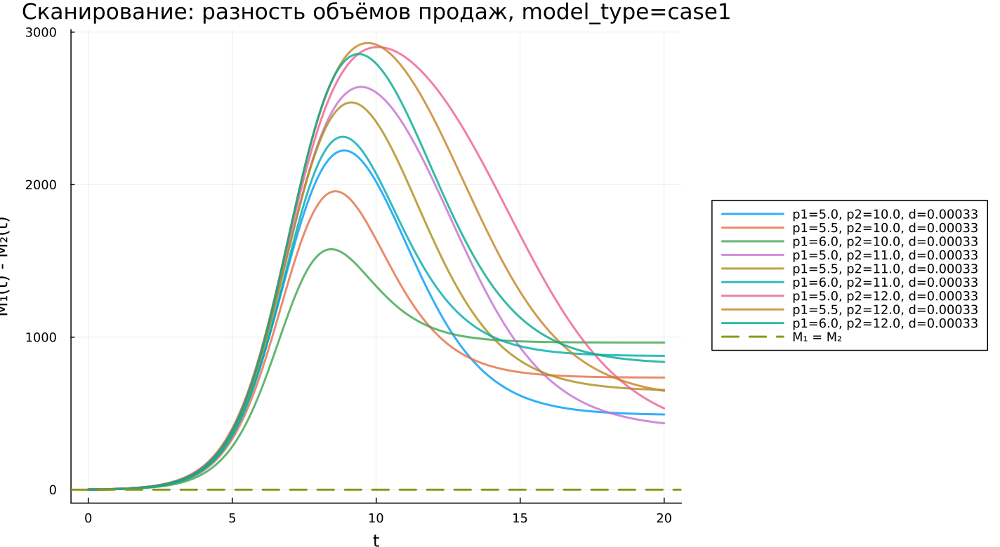

## Анализ разности в первой модели

Во всех экспериментах:

$$
M_1(t) - M_2(t) > 0.
$$

Первая фирма сохраняет преимущество при всех рассмотренных значениях $\widetilde{p}_1$ и $\widetilde{p}_2$.

Параметры влияют на величину преимущества, но не приводят к смене лидера.

## Разность объёмов во второй модели

## Анализ разности во второй модели

Во второй модели многие траектории пересекают линию:

$$
M_1 = M_2.
$$

После пересечения разность становится отрицательной:

$$
M_1(t) - M_2(t) < 0.
$$

Это означает устойчивый переход преимущества ко второй фирме.

## Траектории $M_1(t)$ в первой модели

## Анализ $M_1(t)$ в первой модели

Все траектории $M_1(t)$ монотонно возрастают.

После активной фазы роста первая фирма выходит на устойчивый высокий уровень.

При изменении параметров меняется итоговый уровень $M_1$, но форма динамики остаётся одинаковой.

## Траектории $M_1(t)$ во второй модели

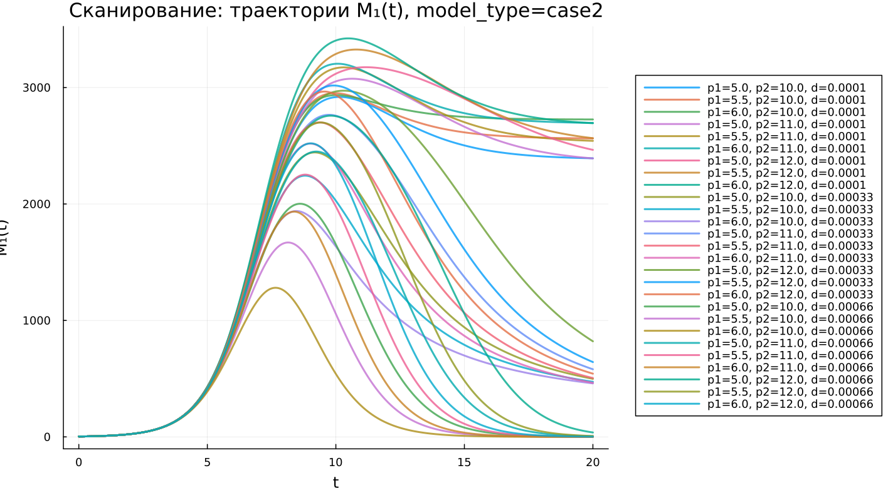

## Анализ $M_1(t)$ во второй модели

Во второй модели траектории $M_1(t)$ не всегда монотонны.

После начального роста объём продаж первой фирмы может снижаться.

При больших значениях $d$ спад выражен сильнее.

В отдельных случаях $M_1(t)$ к концу расчёта становится близким к нулю.

## Траектории $M_2(t)$ в первой модели

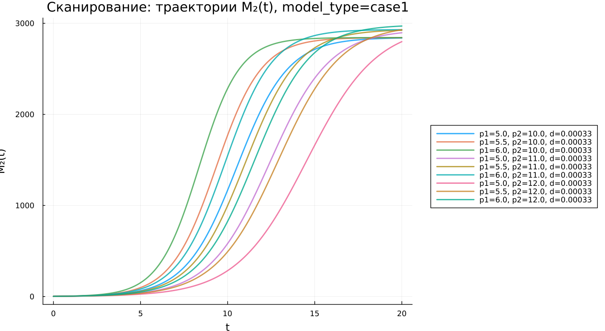

## Анализ $M_2(t)$ в первой модели

Траектории $M_2(t)$ имеют S-образный вид.

Вторая фирма позже входит в активную фазу роста.

Параметры $\widetilde{p}_1$ и $\widetilde{p}_2$ влияют на момент начала быстрого роста и итоговый уровень продаж.

## Траектории $M_2(t)$ во второй модели

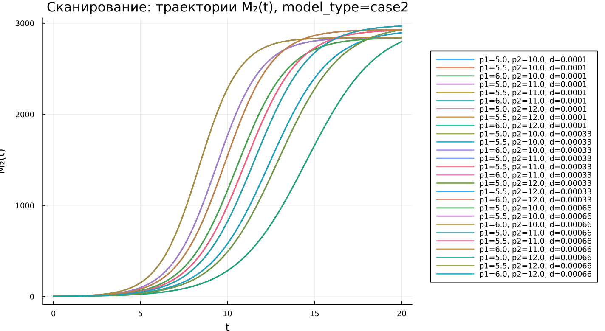

## Анализ $M_2(t)$ во второй модели

Во всех вариантах $M_2(t)$ возрастает монотонно.

Вторая фирма выходит на высокий итоговый уровень продаж.

На фоне роста $M_2(t)$ первая фирма во многих случаях теряет позиции.

## Фазовые траектории первой модели

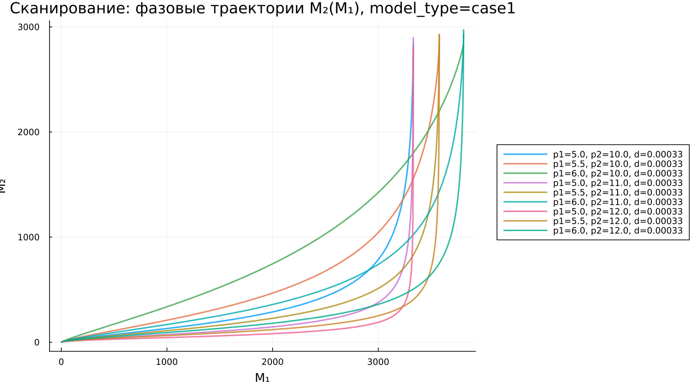

## Анализ фазовых траекторий первой модели

Фазовые траектории $M_2(M_1)$ имеют монотонный характер.

При росте $M_1$ также растёт $M_2$.

Первая модель описывает совместный рост двух фирм без падения объёмов продаж.

## Фазовые траектории второй модели

## Анализ фазовых траекторий второй модели

Во второй модели фазовые траектории имеют петлеобразный вид.

Это означает, что возможен режим:

$$
M_2 \uparrow,
\qquad
M_1 \downarrow.
$$

Социально-психологический фактор приводит к перераспределению рынка в пользу второй фирмы.

# Итоговые показатели

## Влияние параметра $d$

## Анализ влияния $d$

Для первой модели итоговая разность положительна:

$$
M_{1,final} - M_{2,final} > 0.
$$

Для второй модели итоговая разность отрицательна:

$$
M_{1,final} - M_{2,final} < 0.
$$

При увеличении $d$ отрицательная разность становится более выраженной.

## Влияние $\widetilde{p}_1$

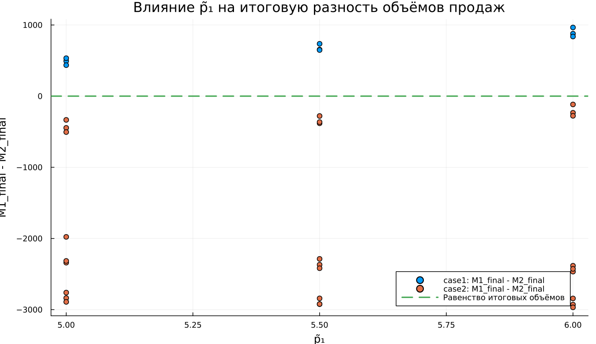

## Анализ влияния $\widetilde{p}_1$

В первой модели рост $\widetilde{p}_1$ усиливает итоговое преимущество первой фирмы.

Во второй модели влияние $\widetilde{p}_1$ не компенсирует действие параметра $d$.

Даже при изменении $\widetilde{p}_1$ вторая фирма часто завершает расчёт с большим объёмом продаж.

## Влияние $\widetilde{p}_2$

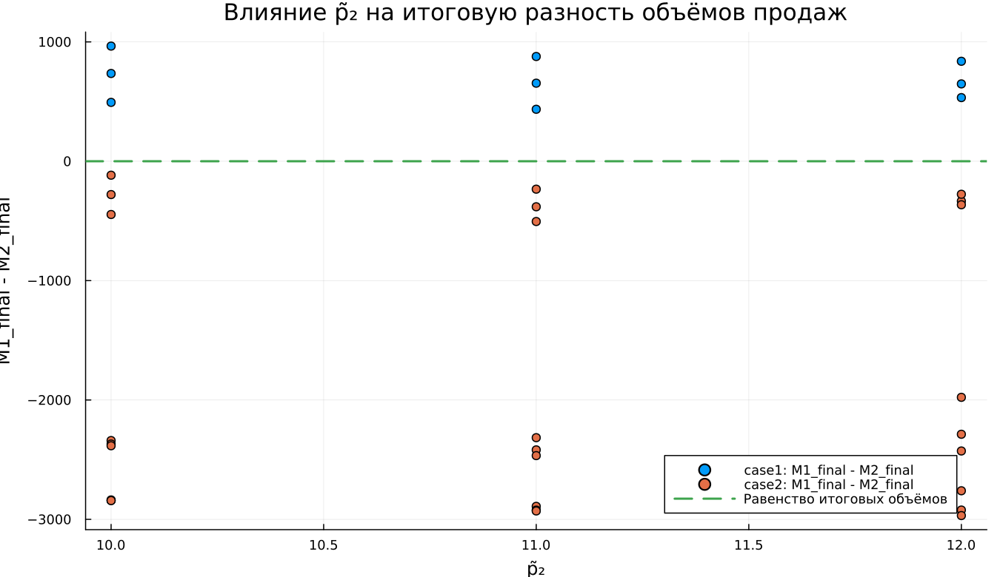

## Анализ влияния $\widetilde{p}_2$

В первой модели итоговая разность остаётся положительной при всех значениях $\widetilde{p}_2$.

Во второй модели итоговая разность чаще отрицательна.

Параметр $\widetilde{p}_2$ влияет на динамику второй фирмы, но итог определяется всей комбинацией параметров.

## Итоговый объём $M_1$

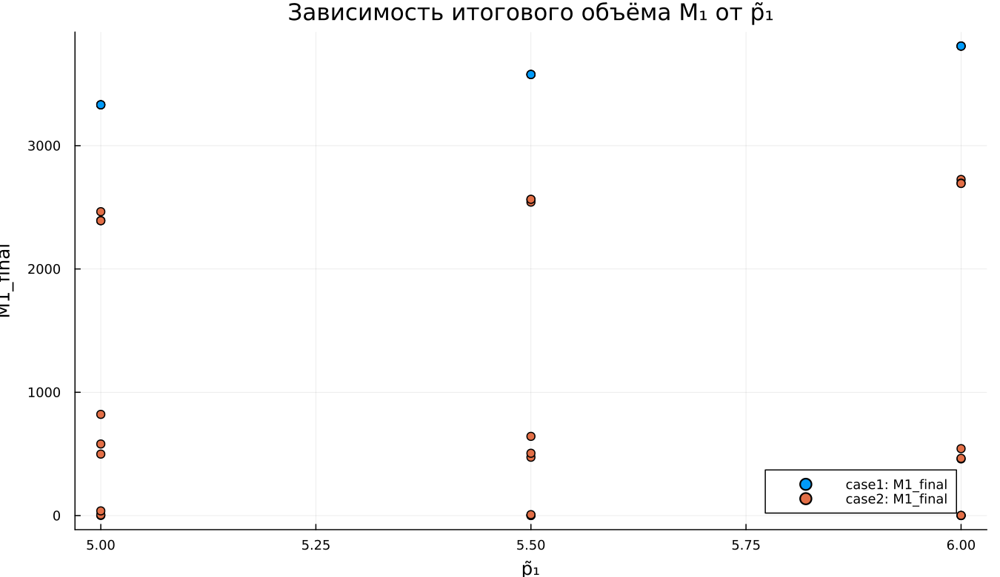

## Анализ $M_{1,final}$

В первой модели $M_{1,final}$ остаётся высоким.

Во второй модели наблюдается большой разброс значений.

При неблагоприятных сочетаниях параметров первая фирма может почти полностью потерять объём продаж.

## Итоговый объём $M_2$

## Анализ $M_{2,final}$

Во всех экспериментах вторая фирма выходит на высокий уровень продаж.

Значения $M_{2,final}$ находятся примерно в диапазоне:

$$
2800 \leq M_{2,final} \leq 2970.
$$

Это подтверждает устойчивость роста второй фирмы.

# Бенчмаркинг

## Время решения от $d$

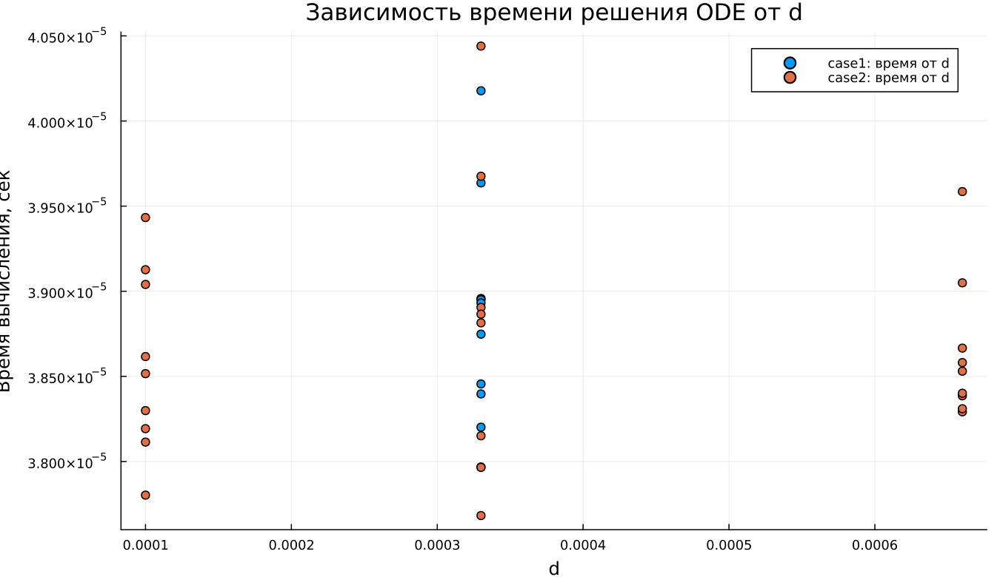

## Время решения от $\widetilde{p}_1$

## Время решения от $\widetilde{p}_2$

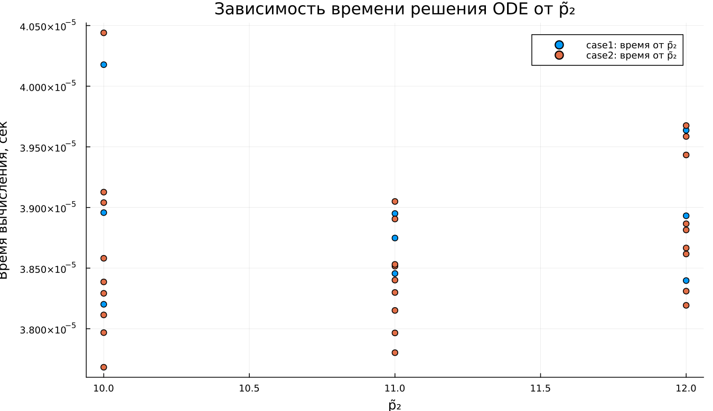

## Анализ времени вычислений

Бенчмаркинг показал:

- обе модели решаются быстро;
- время вычислений имеет порядок $10^{-5}$ секунды;
- изменение $\widetilde{p}_1$, $\widetilde{p}_2$ и $d$ почти не влияет на вычислительную сложность;
- различия времени связаны в основном с особенностями численного интегрирования и измерения.

# Итоги

## Основные результаты

1. Первая модель описывает устойчивое сосуществование фирм.
2. Первая фирма сохраняет преимущество в модели $case1$.
3. Вторая модель учитывает социально-психологический фактор $d$.
4. Во второй модели первая фирма после начального роста может терять объём продаж.
5. Вторая фирма становится лидером в модели $case2$.

## Выводы

1. В первой модели обе фирмы растут и выходят на насыщение.

2. Разность $M_1(t) - M_2(t)$ в первой модели остаётся положительной, поэтому первая фирма сохраняет лидерство.

3. Во второй модели параметр $d$ меняет характер конкуренции и приводит к снижению $M_1(t)$ после максимума.

4. Вторая фирма во второй модели продолжает расти и в итоге обгоняет первую фирму.

5. Параметрическое сканирование подтвердило устойчивость этих различий.

6. Метрика $M_{1,final} - M_{2,final}$ удобна для оценки итогового конкурентного преимущества.

7. При положительном значении $M_{1,final} - M_{2,final}$ лидирует первая фирма.

8. При отрицательном значении $M_{1,final} - M_{2,final}$ лидирует вторая фирма.

9. Увеличение $d$ усиливает преимущество второй фирмы.

10. Численное решение систем выполняется эффективно, а время расчёта остаётся порядка $10^{-5}$ секунды.

# Список литературы {.unnumbered}

1. [Математические модели конкурентной среды](https://dspace.spbu.ru/bitstream/11701/12019/1/Gorynya_2018.pdf)
2. [Разработка математических моделей конкурентных процессов](https://www.academia.edu/9284004/Наумейко_РАЗРАБОТКА_МАТЕМАТИЧЕСКОЙ_МОДЕЛИ_КОНКУРЕНТНЫХ_ПРОЦЕССОВ)
