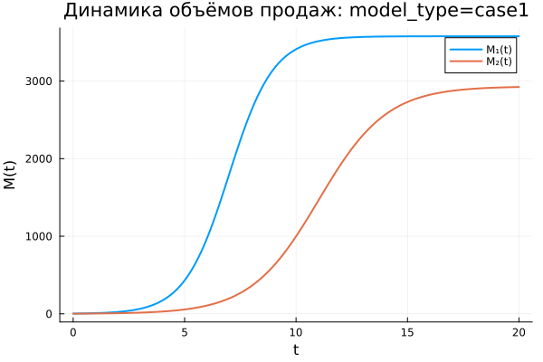
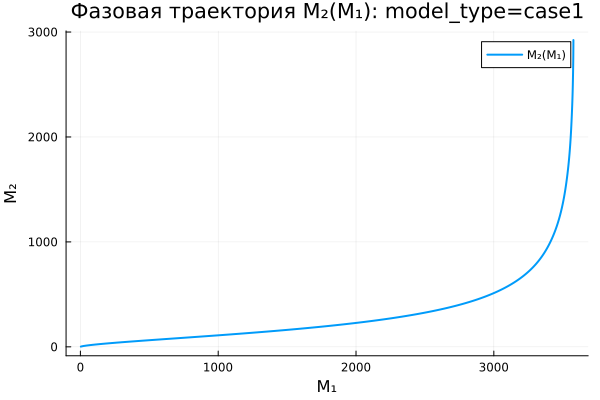
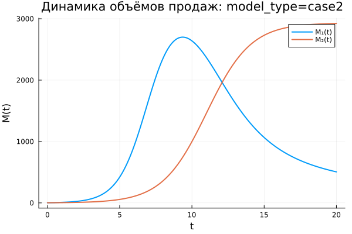
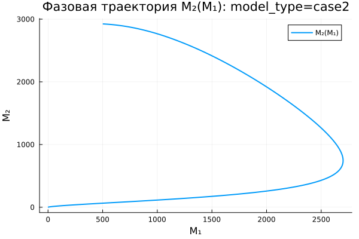
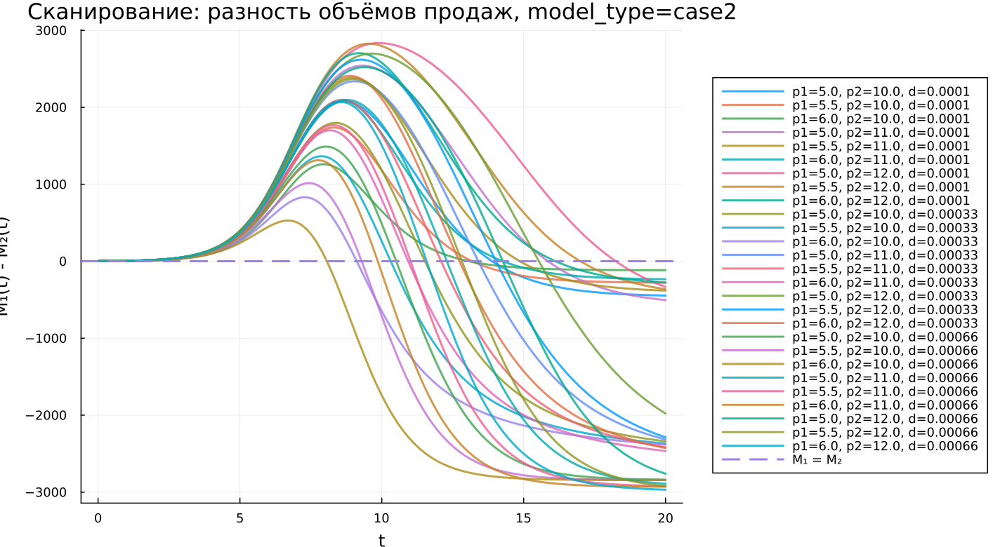
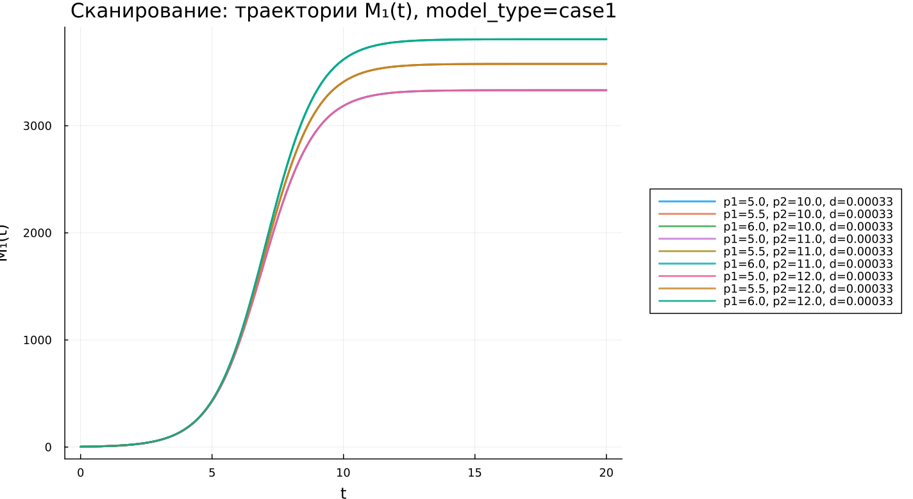
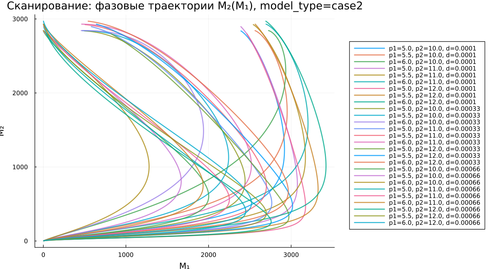
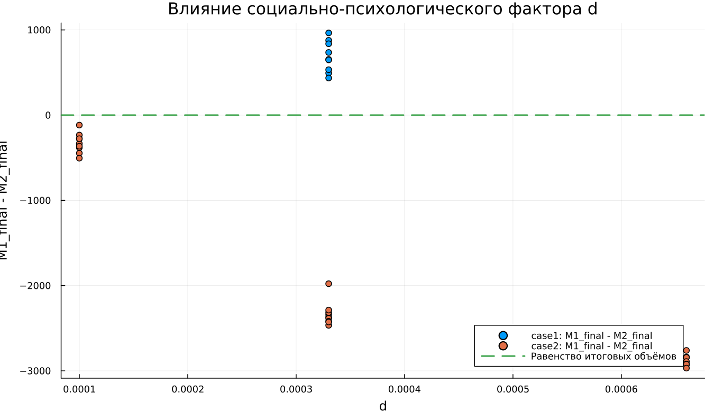
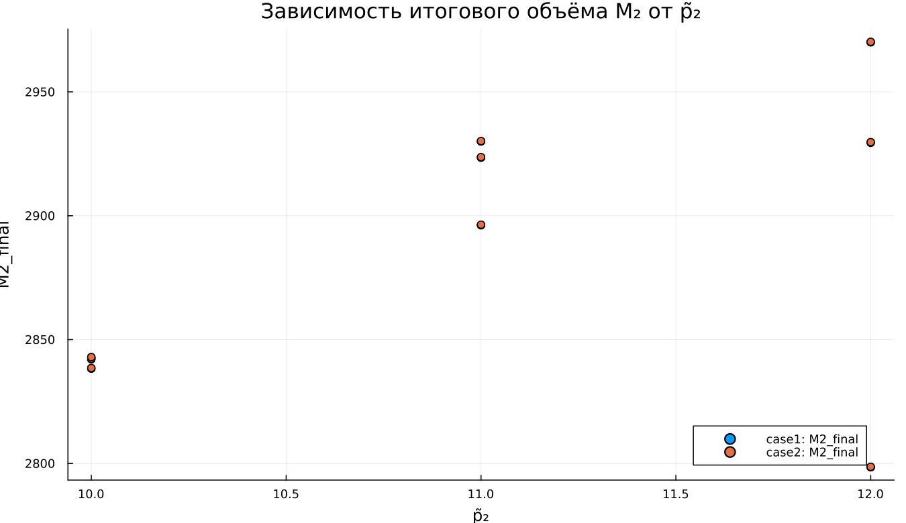
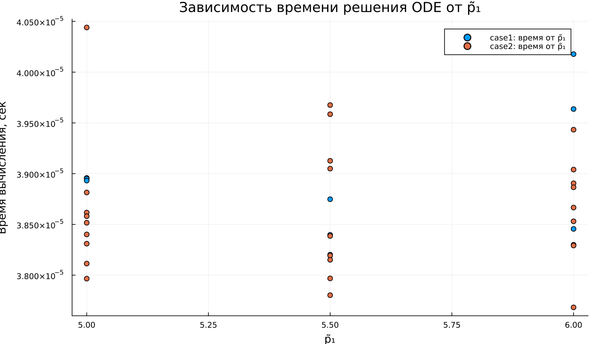

---
## Author
author:
  name: Владимир Базлов
  email: 1132239401@rudn.ru
  affiliation:
    - name: Российский университет дружбы народов
      country: Российская Федерация
      postal-code: 117198
      city: Москва
      address: ул. Миклухо-Маклая, д. 6

## Title
title: "Математическое моделирование"
subtitle: "Лабораторная работа № 8"
license: "CC BY"
---

# Цель работы

Изучить модель конкуренции

# Задание

1.	Изучить модель конкуренции двух фирм
2.	Построить графики изменения оборотных средств в двух случаях

# Выполнение лабораторной работы

## Теоретические сведения

Для построения модели конкуренции хотя бы двух фирм необходимо рассмотреть модель одной фирмы. Вначале рассмотрим модель фирмы, производящей продукт долговременного пользования, когда цена его определяется балансом спроса и предложения. Примем, что этот продукт занимает определенную нишу рынка и конкуренты в ней отсутствуют. 

Обозначим:

$N$ - число потребителей производимого продукта. 

$S$ – доходы потребителей данного продукта. Считаем, что доходы всех потребителей одинаковы. Это предположение справедливо, если речь идет об одной рыночной нише, т.е. производимый продукт ориентирован на определенный слой населения. 

$M$ – оборотные средства предприятия 

$\tau$ - длительность производственного цикла

$p$ - рыночная цена товара 

$\widetilde{p}$ - себестоимость продукта, то есть переменные издержки на производство единицы продукции

$\delta$ - доля оборотных средств, идущая на покрытие переменных издержек

$k$ - постоянные издержки, которые не зависят от количества выпускаемой продукции

$Q(S/p)$ – функция спроса, зависящая от отношения дохода $S$ к цене $p$. Она равна количеству продукта, потребляемого одним потребителем в единицу времени.

Функцию спроса товаров долговременного использования часто представляют в простейшей форме: 

$$Q = q - k\frac{p}{S} = q(1 - \frac{p}{p_{cr}})$$

где $q$ – максимальная потребность одного человека в продукте в единицу времени.
Эта функция падает с ростом цены и при $p = p_{cr}$ (критическая стоимость продукта) потребители отказываются от приобретения товара. Величина $p_{cr} = Sq/k$. Параметр $k$ – мера эластичности функции спроса по цене. Таким образом, функция спроса является пороговой (то есть, $Q(S/p) = 0$ при $p \geq p_{cr}$) и обладает свойствами насыщения.

Уравнения динамики оборотных средств можно записать в виде:

$$\frac{dM}{dt} = -\frac{M \delta}{\tau} + NQp - k = -\frac{M\delta}{\tau} + Nq(1 - \frac{p}{p_{cr}})p - k$$

Уравнение для рыночной цены $p$ представим в виде:

$$\frac{dp}{dt} = \gamma (-\frac{M\delta}{\tau \widetilde{p}} + Nq(1-\frac{p}{p_{cr}}) )$$

Первый член соответствует количеству поставляемого на рынок товара (то есть, предложению), а второй член – спросу.
Параметр $\gamma$ зависит от скорости оборота товаров на рынке. Как правило, время торгового оборота существенно меньше времени производственного цикла $\tau$. При заданном M уравнение описывает быстрое стремление цены к равновесному значению цены, которое устойчиво.

В этом случае уравнение можно заменить алгебраическим соотношением

$$ -\frac{M\delta}{\tau \widetilde{p}} + Nq(1-\frac{p}{p_{cr}}) = 0$$

равновесное значение цены $p$ равно

$$ p = p_{cr}(1 - \frac{M\delta}{\tau \widetilde{p} Nq})$$

Тогда уравнения динамики оборотных средств приобретает вид

$$\frac{dM}{dt} = -\frac{M \delta}{\tau}(\frac{p}{p_{cr}}-1) - M^2 ( \frac{\delta}{\tau \widetilde{p} })^2 \frac{p_{cr}}{Nq} - k$$

Это уравнение имеет два стационарных решения, соответствующих условию $dM/dt=0$

$$ \widetilde{M_{1,2}} = \frac{1}{2} a \pm \sqrt{\frac{a^2}{4} - b}$$

где

$$ a = Nq(1 - \frac{\widetilde{p}}{p_{cr}} \widetilde{p} \frac{\tau}{\delta}), b = kNq \frac{(\tau \widetilde{p})^2}{p_{cr}\delta ^2} $$

Получается, что при больших постоянных издержках (в случае $a^2 < 4b$) стационарных состояний нет. Это означает, что в этих условиях фирма не может функционировать стабильно, то есть, терпит банкротство. Однако, как правило, постоянные затраты малы по сравнению с переменными (то есть, $b << a^2$) и играют роль, только в случае, когда оборотные средства малы. 

При $b << a$ стационарные значения $M$ равны

$$ \widetilde{M_{+}} = Nq \frac{\tau}{\delta}(1 - \frac{\widetilde{p}}{p_{cr}})\widetilde{p}, \widetilde{M_{-}} = k\widetilde{p} \frac{\tau}{\delta(p_{cr} - \widetilde{p})} $$

Первое состояние $\widetilde{M_{+}}$ устойчиво и соответствует стабильному функционированию предприятия. Второе состояние \widetilde{M_{-} неустойчиво, так, что при $M < \widetilde{M_{-}}$ оборотные средства падают ($dM/dt < 0$), то есть, фирма идет к банкротству. По смыслу $\widetilde{M_{-}}$ соответствует начальному капиталу, необходимому для входа в рынок.

В обсуждаемой модели параметр $\delta$ всюду входит в сочетании с $\tau$. Это значит, что уменьшение доли оборотных средств, вкладываемых в производство, эквивалентно удлинению производственного цикла. Поэтому мы в дальнейшем положим: $\delta = 1$, а параметр $\tau$ будем считать временем цикла, с учётом сказанного.

## Задача

Случай 1

Рассмотрим две фирмы, производящие взаимозаменяемые товары одинакового качества и находящиеся в одной рыночной нише. Считаем, что в рамках нашей модели конкурентная борьба ведётся только рыночными методами. То есть, конкуренты могут влиять на противника путем изменения параметров своего производства: себестоимость, время цикла, но не могут прямо вмешиваться в ситуацию на рынке («назначать» цену или влиять на потребителей каким-либо иным способом.) Будем считать, что постоянные издержки пренебрежимо малы, и в модели учитывать не будем. В этом случае динамика изменения объемов продаж фирмы 1 и фирмы 2 описывается следующей системой уравнений:

$$\frac{dM_1}{d\Theta} = M_1 - \frac{b}{c_1}M_1 M_2 - \frac{a1}{c1} M_1^2 $$

$$ \frac{dM_2}{d\Theta} = \frac{c_2}{c_1} M_2 - \frac{b}{c_1} M_1 M_2 - \frac{a_2}{c_1} M_2^2$$
где 

$$ a_1 = \frac{p_{cr}}{\tau_1^2 \widetilde{p}_1^2 Nq } $$
$$ a_2 = \frac{p_{cr}}{\tau_2^2 \widetilde{p}_2^2 Nq } $$ 
$$ b = \frac{p_{cr}}{\tau_1^2 \widetilde{p}_1^2 \tau_2^2 \widetilde{p}_2^2 Nq} $$
$$ c_1 = \frac{p_{cr} - \widetilde{p}_1}{\tau_1 \widetilde{p}_1} $$
$$ c_2 = \frac{p_{cr} - \widetilde{p}_2}{\tau_2 \widetilde{p}_2} $$

также введена нормировка $t = c_1 \Theta$

Случай 2

Рассмотрим модель, когда, помимо экономического фактора влияния (изменение себестоимости, производственного цикла, использование кредита и т.п.), используются еще и социально-психологические факторы – формирование общественного предпочтения одного товара другому, не зависимо от их качества и цены. В этом случае взаимодействие двух фирм будет зависеть друг от друга, соответственно коэффициент перед $M_1 M_2$ будет отличаться. Пусть в рамках рассматриваемой модели динамика изменения объемов продаж фирмы 1 и фирмы 2 описывается следующей системой уравнений:

$$\frac{dM_1}{d\Theta} = M_1 - (\frac{b}{c_1} + 0.00033)M_1 M_2 - \frac{a1}{c1} M_1^2 $$

$$ \frac{dM_2}{d\Theta} = \frac{c_2}{c_1} M_2 - \frac{b}{c_1} M_1 M_2 - \frac{a_2}{c_1} M_2^2$$

Для обоих случаев рассмотрим задачу со следующими начальными условиями и параметрами

$$ M_0^1=3.3 \: M_0^2=2.2 $$
$$ p_{cr}=26 \: N=33 \: q=1 $$
$$ \tau_1=25 \: \tau_2=14 $$
$$ \widetilde{p}_1=5.5 \: \widetilde{p}_2=11 $$





## Базовые эксперименты

### Первая модель $(model\_type = case1)$

В первой модели рассматривается конкуренция двух фирм без дополнительного социально-психологического влияния. Взаимодействие фирм задаётся только экономическими параметрами модели: характеристиками производственного цикла, ценовыми параметрами и коэффициентами, рассчитанными на их основе.

На графике динамики объёмов продаж видно, что обе фирмы демонстрируют рост. Кривая $M_1(t)$ начинает быстро увеличиваться раньше, чем $M_2(t)$. Первая фирма выходит на активную фазу роста примерно после $t \approx 4$, затем её объём продаж резко возрастает и к моменту $t \approx 10$ почти достигает устойчивого уровня. После этого рост заметно замедляется, а график переходит в почти горизонтальный участок.

Вторая фирма также увеличивает объём продаж, но её рост начинается позже. Активная фаза для $M_2(t)$ наблюдается примерно после $t \approx 8$. К концу расчётного интервала объём продаж второй фирмы продолжает приближаться к своему предельному уровню, но остаётся ниже итогового значения первой фирмы. Это означает, что в первом сценарии первая фирма быстрее занимает рыночную нишу и сохраняет преимущество до конца моделирования.

График скорости изменения объёмов продаж показывает, что максимальная скорость роста первой фирмы достигается раньше, чем у второй. Производная $dM_1/dt$ имеет выраженный пик примерно при $t \approx 7$. После достижения максимума скорость быстро снижается и стремится к нулю, что соответствует выходу $M_1(t)$ на насыщение.

Скорость изменения $dM_2/dt$ достигает максимума позднее, примерно при $t \approx 11$. Пик второй фирмы ниже пика первой, а сама кривая шире. Это говорит о более растянутом во времени росте. Вторая фирма наращивает продажи медленнее, но её рост продолжается дольше. После прохождения максимума производная также убывает и приближается к нулю.

График разности $M_1(t) - M_2(t)$ показывает устойчивое преимущество первой фирмы на всём интервале времени. В начале расчёта разность мала, поскольку начальные объёмы продаж обеих фирм близки. Затем преимущество первой фирмы быстро увеличивается и достигает максимума примерно около $t \approx 9$. После этого разность начинает снижаться, потому что вторая фирма входит в активную фазу роста и постепенно сокращает отставание.

Несмотря на уменьшение разности во второй половине интервала, график не пересекает горизонтальную линию равенства. Значение $M_1(t) - M_2(t)$ остаётся положительным. Это означает, что первая фирма сохраняет лидерство до конца расчёта. При этом разрыв между фирмами к концу интервала становится меньше, чем в момент максимального преимущества первой фирмы.

Фазовая траектория $M_2(M_1)$ показывает совместное изменение объёмов продаж двух фирм. В начале траектория идёт полого: $M_1$ растёт быстрее, чем $M_2$. Это соответствует начальному преимуществу первой фирмы. Затем при больших значениях $M_1$ кривая становится более крутой, что отражает ускорение роста второй фирмы.

Форма фазовой траектории показывает, что развитие фирм происходит не синхронно. Сначала рынок быстрее осваивает первая фирма, затем вторая фирма начинает активнее увеличивать объём продаж. Однако даже при ускорении роста второй фирмы траектория не указывает на смену лидера в пределах выбранного интервала.

Первая модель демонстрирует режим устойчивого роста обеих фирм с сохранением преимущества первой фирмы. Конкуренция замедляет рост после активной фазы, но не приводит к падению объёмов продаж. Обе фирмы выходят на насыщение, причём первая достигает высокого уровня раньше и удерживает больший итоговый объём.

### Вторая модель $(model\_type = case2)$

Во второй модели учитывается дополнительный социально-психологический фактор, который усиливает влияние второй фирмы на первую. В результате коэффициент взаимодействия в уравнении для $M_1(t)$ увеличивается, и динамика первой фирмы заметно меняется по сравнению с первым случаем.

На графике динамики видно, что в начале процесса первая фирма снова растёт быстрее. Кривая $M_1(t)$ резко увеличивается и достигает максимального значения примерно около $t \approx 9$. Однако после этого объём продаж первой фирмы начинает снижаться. Это главное отличие второй модели от первой: в первом случае $M_1(t)$ выходила на устойчивое насыщение, а во втором случае после достижения максимума наблюдается спад.

Вторая фирма, наоборот, после начального медленного роста переходит к активному увеличению объёма продаж. Кривая $M_2(t)$ начинает резко расти примерно после $t \approx 8$ и к концу интервала приближается к высокому устойчивому уровню. После $t \approx 12$ объём продаж второй фирмы становится больше объёма продаж первой фирмы. Это показывает смену лидера в системе.

График скорости изменения подтверждает данный вывод. Производная $dM_1/dt$ сначала положительна и имеет выраженный максимум примерно при $t \approx 7$. В этот период первая фирма быстро увеличивает объём продаж. Затем скорость резко снижается, пересекает нулевой уровень и становится отрицательной. Отрицательные значения $dM_1/dt$ означают, что объём продаж первой фирмы начинает уменьшаться.

Минимум $dM_1/dt$ наблюдается примерно около $t \approx 12$. После этого отрицательная скорость постепенно возрастает к нулю, то есть спад первой фирмы замедляется. К концу интервала объём продаж первой фирмы продолжает снижаться, но темп падения уже становится менее резким.

Скорость $dM_2/dt$ остаётся положительной на всём интервале. Она достигает максимума примерно около $t \approx 11$, после чего начинает снижаться. Это означает, что вторая фирма продолжает увеличивать продажи на протяжении всего расчётного периода, но после активной фазы её рост постепенно замедляется. В отличие от первой фирмы, для второй фирмы отрицательных значений производной не наблюдается.

График разности $M_1(t) - M_2(t)$ особенно наглядно показывает смену положения фирм. В начале разность положительна и быстро увеличивается, что соответствует начальному лидерству первой фирмы. Максимальное преимущество первой фирмы достигается примерно около $t \approx 9$. Затем разность начинает быстро уменьшаться.

Примерно в районе $t \approx 12$ график пересекает линию равенства. После этого значение $M_1(t) - M_2(t)$ становится отрицательным. Это означает, что вторая фирма обгоняет первую по объёму продаж. К концу расчётного интервала отрицательная разность продолжает увеличиваться по модулю, поэтому преимущество второй фирмы становится значительным.

Фазовая траектория $M_2(M_1)$ во второй модели имеет петлеобразный характер. В начале траектория движется вправо и вверх: обе фирмы растут, но первая фирма увеличивает объём быстрее. Затем траектория достигает области максимального значения $M_1$, после чего меняет направление: $M_1$ начинает уменьшаться, а $M_2$ продолжает увеличиваться.

Именно эта особенность отличает второй случай от первого. В первой модели фазовая траектория была монотонной: рост $M_1$ сопровождался ростом $M_2$. Во второй модели появляется участок, где $M_2$ растёт при одновременном снижении $M_1$. Это отражает перераспределение рыночного преимущества в пользу второй фирмы.

Вторая модель показывает, что дополнительный социально-психологический фактор существенно меняет динамику конкуренции. Первая фирма получает преимущество в начале процесса, но не удерживает его. После достижения максимального объёма продаж она начинает терять позиции, тогда как вторая фирма продолжает расти и становится лидером к концу расчётного интервала.

## Сравнение базовых экспериментов

В обеих моделях первая фирма быстрее входит в активную фазу роста. На начальном участке $M_1(t)$ увеличивается быстрее, чем $M_2(t)$, поэтому первая фирма получает раннее преимущество. Однако дальнейшая динамика в двух случаях различается.

В первой модели обе фирмы растут монотонно. Первая фирма достигает насыщения раньше, вторая фирма растёт медленнее и выходит на высокий уровень позднее. Разность $M_1(t) - M_2(t)$ остаётся положительной на всём интервале, поэтому первая фирма сохраняет лидерство до конца моделирования.

Во второй модели начальное преимущество первой фирмы оказывается временным. После достижения максимума объём продаж $M_1(t)$ начинает снижаться, а $M_2(t)$ продолжает расти. График разности пересекает нулевой уровень, что показывает смену лидера. В конце интервала вторая фирма имеет значительно больший объём продаж.

Графики производных также демонстрируют различие между моделями. В первом случае обе производные остаются положительными и стремятся к нулю после прохождения максимумов. Это соответствует замедляющемуся росту обеих фирм. Во втором случае производная $dM_1/dt$ становится отрицательной, что указывает не просто на замедление, а на фактическое снижение продаж первой фирмы.

Фазовые траектории подтверждают различный характер взаимодействия. Для первой модели траектория отражает совместный рост двух фирм без разворота динамики. Для второй модели появляется участок обратного движения по оси $M_1$, где первая фирма теряет объём продаж, а вторая продолжает укреплять положение.

Сравнение показывает, что добавление социально-психологического фактора меняет качественный характер модели. В первом случае конкуренция приводит к устойчивому сосуществованию фирм с преимуществом первой. Во втором случае дополнительное влияние усиливает позиции второй фирмы и приводит к перераспределению рынка в её пользу.

## Параметрическое сканирование

В рамках параметрического сканирования анализируется, как изменение параметров $\widetilde{p}_1$, $\widetilde{p}_2$ и $d$ влияет на динамику объёмов продаж двух фирм. На графиках используются обозначения $p1 = \widetilde{p}_1$ и $p2 = \widetilde{p}_2$.

Для первой модели параметр $d$ остаётся фиксированным и равен $d = 0{,}00033$, поскольку дополнительное социально-психологическое влияние в данной модели не изменяет структуру взаимодействия фирм. Для второй модели параметр $d$ варьируется, что позволяет оценить влияние дополнительного фактора на перераспределение объёмов продаж между фирмами.

### Сравнение разности объёмов продаж для первой модели $(model\_type = case1)$

На графике показана динамика разности объёмов продаж $M_1(t) - M_2(t)$ для первой модели при различных значениях параметров $\widetilde{p}_1$ и $\widetilde{p}_2$. Горизонтальная пунктирная линия соответствует условию равенства объёмов продаж двух фирм: $M_1 = M_2$.

Во всех рассмотренных вариантах разность $M_1(t) - M_2(t)$ остаётся положительной на всём расчётном интервале. Это означает, что первая фирма сохраняет преимущество над второй фирмой независимо от выбранной комбинации параметров. Графики не пересекают линию $M_1 = M_2$, поэтому смены лидера в первой модели не происходит.

В начале расчёта разность близка к нулю, поскольку начальные значения объёмов продаж фирм сравнительно малы. Затем разность быстро увеличивается: первая фирма раньше входит в активную фазу роста и временно значительно опережает вторую фирму. Максимальное преимущество достигается примерно на интервале $t \approx 8$--$10$.

После достижения максимума разность начинает уменьшаться. Это связано с тем, что вторая фирма позже входит в активную фазу роста и постепенно сокращает отставание. Несмотря на это, к концу интервала $M_1(t)$ всё ещё остаётся больше $M_2(t)$.

Разные кривые отличаются высотой максимума и итоговым уровнем разности. При одних наборах параметров максимальное преимущество первой фирмы достигает почти $3000$, при других остаётся ниже. Это показывает, что параметры $\widetilde{p}_1$ и $\widetilde{p}_2$ влияют не на сам факт лидерства первой фирмы, а на величину временного преимущества и скорость его последующего сокращения.

Первая модель при всех рассмотренных параметрах описывает режим устойчивого преимущества первой фирмы. Вторая фирма может сокращать разрыв, но не обгоняет первую в пределах заданного временного интервала.

### Сравнение разности объёмов продаж для второй модели $(model\_type = case2)$

На графике представлена динамика разности $M_1(t) - M_2(t)$ для второй модели при различных значениях $\widetilde{p}_1$, $\widetilde{p}_2$ и $d$. В отличие от первой модели, здесь учитывается дополнительный социально-психологический фактор, который усиливает влияние второй фирмы на первую.

В начале расчёта почти все траектории ведут себя похожим образом: разность близка к нулю, затем становится положительной и быстро увеличивается. Это означает, что первая фирма, как и в первой модели, сначала получает преимущество. Максимум разности достигается примерно в области $t \approx 8$--$10$.

После максимума графики начинают резко снижаться. Для большинства комбинаций параметров разность пересекает линию $M_1 = M_2$ и становится отрицательной. Это означает, что вторая фирма обгоняет первую по объёму продаж. В отличие от первой модели, здесь начальное преимущество первой фирмы оказывается временным.

К концу расчётного интервала часть траекторий достигает значений около $-2500$ и ниже. Это указывает на значительное преимущество второй фирмы. Чем сильнее влияние дополнительного фактора и чем быстрее вторая фирма входит в активную фазу роста, тем раньше происходит пересечение нулевой линии и тем больше итоговый перевес второй фирмы.

На графике виден широкий разброс траекторий. Он связан с одновременным изменением параметров $\widetilde{p}_1$, $\widetilde{p}_2$ и $d$. Одни комбинации параметров приводят к ранней потере лидерства первой фирмой, другие позволяют ей дольше удерживать преимущество. Однако общий характер второй модели остаётся выраженным: социально-психологический фактор делает систему склонной к перераспределению рынка в пользу второй фирмы.

Вторая модель демонстрирует более чувствительную динамику по сравнению с первой. Наличие отрицательных значений $M_1(t) - M_2(t)$ показывает, что дополнительный фактор меняет не только величину разрыва, но и само направление конкурентного преимущества.

### Сравнение траекторий $M_1(t)$ для первой модели $(model\_type = case1)$

На графике показаны траектории $M_1(t)$ для первой модели при различных значениях $\widetilde{p}_1$ и $\widetilde{p}_2$. Все кривые имеют одинаковый общий характер: объём продаж первой фирмы монотонно возрастает и затем выходит на насыщение.

В начале расчёта значения $M_1(t)$ малы. Примерно после $t \approx 4$ начинается быстрый рост. На интервале $t \approx 5$--$9$ наблюдается основная активная фаза увеличения объёма продаж первой фирмы. Затем рост замедляется, и траектории переходят в почти горизонтальные участки.

Кривые отличаются итоговым уровнем насыщения. При одних сочетаниях параметров $M_1(t)$ выходит на уровень выше $3500$, при других стабилизируется ближе к $3300$. Это показывает, что изменение $\widetilde{p}_1$ и $\widetilde{p}_2$ влияет на предельный объём продаж первой фирмы.

При этом форма траекторий остаётся устойчивой: ни одна кривая не демонстрирует падения после достижения высокого уровня. Следовательно, в первой модели первая фирма сохраняет накопленный объём продаж, а конкурентное взаимодействие лишь ограничивает дальнейший рост.

График подтверждает вывод, полученный при анализе разности $M_1(t) - M_2(t)$: первая фирма в первой модели занимает сильную позицию и выходит на устойчивый высокий уровень объёма продаж при всех рассмотренных параметрах.

### Сравнение траекторий $M_1(t)$ для второй модели $(model\_type = case2)$

На графике представлены траектории $M_1(t)$ для второй модели при разных значениях $\widetilde{p}_1$, $\widetilde{p}_2$ и $d$. В отличие от первой модели, здесь траектории не всегда являются монотонными.

На начальном участке почти все кривые демонстрируют быстрый рост. Первая фирма активно увеличивает объём продаж примерно до интервала $t \approx 8$--$11$. После этого для значительной части траекторий начинается снижение $M_1(t)$. Это означает, что первая фирма сначала усиливает позиции, но затем теряет часть рынка под влиянием второй фирмы.

Разброс траекторий во второй модели значительно больше, чем в первой. Для одних комбинаций параметров $M_1(t)$ после максимума снижается умеренно и к концу расчёта остаётся на уровне около $2500$--$3000$. Для других комбинаций спад оказывается резким, и объём продаж первой фирмы к концу интервала приближается к нулю.

Особенно заметно влияние параметра $d$. При большем значении $d$ отрицательное воздействие взаимодействия на первую фирму усиливается. В результате после достижения максимума объём продаж $M_1(t)$ быстрее уменьшается. При меньшем $d$ первая фирма способна дольше удерживать высокий уровень.

Вторая модель показывает, что дополнительное социально-психологическое влияние может привести к качественному изменению динамики первой фирмы. Если в первой модели $M_1(t)$ выходит на насыщение, то во второй модели рост может сменяться спадом. Это отражает потерю конкурентного преимущества первой фирмы после начальной активной фазы.

### Сравнение траекторий $M_2(t)$ для первой модели $(model\_type = case1)$

На графике показаны траектории $M_2(t)$ для первой модели при различных значениях $\widetilde{p}_1$ и $\widetilde{p}_2$. Все кривые имеют S-образный вид, характерный для роста с последующим насыщением.

В начале расчётного интервала объём продаж второй фирмы увеличивается медленно. Затем, в зависимости от набора параметров, активная фаза роста начинается примерно в области $t \approx 7$--$12$. После этого $M_2(t)$ быстро возрастает и к концу расчёта приближается к уровню около $2700$--$3000$.

Сдвиг кривых по времени показывает, что параметры $\widetilde{p}_1$ и $\widetilde{p}_2$ существенно влияют на скорость выхода второй фирмы в активную фазу роста. При одних комбинациях параметров вторая фирма начинает быстро расти раньше, при других рост заметно запаздывает.

Несмотря на различия в моменте начала активного роста, все траектории сохраняют общий монотонный характер. Объём продаж второй фирмы не уменьшается, а постепенно приближается к предельному уровню. Это соответствует поведению первой модели, где конкуренция ограничивает рост, но не вызывает падения продаж.

К концу расчётного интервала значения $M_2(t)$ для разных комбинаций параметров становятся близкими, хотя полностью не совпадают. Это говорит о том, что параметры сильнее влияют на скорость достижения высокого уровня, чем на сам факт выхода второй фирмы на насыщение.

### Сравнение траекторий $M_2(t)$ для второй модели $(model\_type = case2)$

На графике представлены траектории $M_2(t)$ для второй модели при различных значениях $\widetilde{p}_1$, $\widetilde{p}_2$ и $d$. В отличие от траекторий $M_1(t)$, объём продаж второй фирмы во всех рассмотренных случаях возрастает монотонно.

В начале расчёта $M_2(t)$ увеличивается медленно. Затем вторая фирма входит в активную фазу роста. В зависимости от параметров этот переход происходит примерно на интервале $t \approx 7$--$15$. После активного роста траектории постепенно выходят на высокий уровень, близкий к $2800$--$3000$.

Изменение параметров заметно сдвигает траектории по времени. Одни кривые начинают быстро расти раньше и раньше приближаются к насыщению. Другие долго остаются на низком уровне, а затем резко возрастают во второй половине расчётного интервала. Это показывает чувствительность скорости роста второй фирмы к выбранным параметрам.

Параметр $d$ влияет на траектории косвенно через усиление воздействия второй фирмы на первую. При увеличении $d$ первая фирма быстрее теряет позиции, что создаёт условия для более заметного преимущества второй фирмы. При этом сама траектория $M_2(t)$ остаётся возрастающей.

Вторая модель подчёркивает асимметрию взаимодействия фирм. Первая фирма может после максимума снижать объём продаж, а вторая фирма во всех вариантах продолжает рост. Это объясняет появление отрицательных значений разности $M_1(t) - M_2(t)$ на графиках параметрического сканирования.

### Сравнение фазовых траекторий $M_2(M_1)$ для первой модели $(model\_type = case1)$

На графике представлены фазовые траектории $M_2(M_1)$ для первой модели. Каждая кривая показывает совместное изменение объёмов продаж двух фирм при определённой комбинации параметров $\widetilde{p}_1$ и $\widetilde{p}_2$.

Все фазовые траектории имеют монотонный характер: при увеличении $M_1$ одновременно увеличивается $M_2$. Это означает, что в первой модели обе фирмы развиваются в одном направлении. Конкуренция не приводит к снижению объёма продаж одной фирмы при росте другой.

В начале траектории проходят в нижней части графика. На этом участке значения $M_1$ и $M_2$ малы. Затем $M_1$ начинает расти быстрее, поэтому траектории вытягиваются вправо. На позднем участке кривая становится более крутой: рост $M_2$ ускоряется, а $M_1$ уже близок к насыщению.

Различия между траекториями связаны с разными параметрами $\widetilde{p}_1$ и $\widetilde{p}_2$. Одни варианты приводят к большему предельному значению $M_1$, другие к более раннему и быстрому росту $M_2$. Однако общий вид фазовых траекторий остаётся одинаковым.

Фазовый график подтверждает, что первая модель описывает совместный рост двух фирм без смены направления динамики. Первая фирма раньше занимает большую часть рынка, а вторая фирма затем догоняет её частично, но не вызывает падения $M_1$.

### Сравнение фазовых траекторий $M_2(M_1)$ для второй модели $(model\_type = case2)$

На графике показаны фазовые траектории $M_2(M_1)$ для второй модели. По сравнению с первой моделью их форма заметно сложнее: многие кривые имеют петлеобразный вид и содержат участки, где $M_1$ уменьшается при продолжающемся росте $M_2$.

В начале траектории движутся вправо и вверх. Это соответствует периоду, когда обе фирмы увеличивают объём продаж, а первая фирма растёт быстрее. Затем траектории достигают области максимальных значений $M_1$. После этого направление движения меняется: $M_1$ начинает снижаться, а $M_2$ продолжает увеличиваться.

Наличие участков обратного движения по оси $M_1$ является главным отличием второй модели. Оно означает, что первая фирма не просто замедляет рост, а теряет объём продаж. Одновременно вторая фирма продолжает усиливать позиции. В фазовом пространстве это выглядит как разворот траектории влево при движении вверх.

Разброс фазовых траекторий показывает высокую чувствительность второй модели к параметрам $\widetilde{p}_1$, $\widetilde{p}_2$ и $d$. При одних комбинациях параметров разворот происходит раньше, при других первая фирма дольше сохраняет высокий уровень $M_1$. Чем сильнее дополнительный фактор $d$, тем заметнее перераспределение в пользу второй фирмы.

Фазовые траектории второй модели подтверждают выводы, полученные по графикам $M_1(t)$, $M_2(t)$ и $M_1(t) - M_2(t)$. Социально-психологическое влияние меняет характер конкуренции: система переходит от совместного насыщаемого роста к режиму, где рост второй фирмы сопровождается снижением объёма продаж первой фирмы.

## Анализ итоговых показателей параметрического сканирования

### Влияние социально-психологического фактора $d$ на итоговую разность объёмов продаж

На графике показана зависимость итоговой разности объёмов продаж $M_{1,final} - M_{2,final}$ от параметра $d$. Горизонтальная пунктирная линия соответствует равенству итоговых объёмов продаж двух фирм: $M_{1,final} = M_{2,final}$.

Для первой модели точки располагаются выше нулевого уровня. Это означает, что при базовом значении $d = 0{,}00033$ первая фирма сохраняет итоговое преимущество над второй фирмой. Поскольку в первой модели дополнительный социально-психологический фактор фактически не изменяет структуру взаимодействия, параметр $d$ здесь не играет самостоятельной роли и используется только как фиксированное значение в общей сетке параметров.

Для второй модели все точки располагаются ниже линии равенства. Это показывает, что при учёте социально-психологического фактора итоговый объём продаж второй фирмы становится больше итогового объёма продаж первой фирмы. Значения $M_{1,final} - M_{2,final}$ отрицательны, поэтому конкурентное преимущество переходит ко второй фирме.

При увеличении $d$ отрицательная разность становится более выраженной. Для малых значений $d$ итоговый проигрыш первой фирмы сравнительно умеренный, но при $d = 0{,}00033$ и особенно при $d = 0{,}00066$ точки смещаются вниз, достигая значений порядка $-2500$ и ниже. Это означает, что усиление социально-психологического фактора приводит к более сильному перераспределению рынка в пользу второй фирмы.

График подтверждает качественное различие между двумя моделями. В первой модели первая фирма сохраняет лидерство, а во второй модели дополнительное влияние меняет итоговый баланс и делает вторую фирму доминирующей.

### Влияние $\widetilde{p}_1$ на итоговую разность объёмов продаж

На графике представлена зависимость итоговой разности $M_{1,final} - M_{2,final}$ от параметра $\widetilde{p}_1$. Параметр $\widetilde{p}_1$ входит в коэффициенты первой фирмы и влияет на её динамику через величины $a_1$, $b$ и $c_1$.

Для первой модели все точки находятся выше нулевой линии. Это означает, что при всех рассмотренных значениях $\widetilde{p}_1$ первая фирма завершает расчётный интервал с большим объёмом продаж, чем вторая. При увеличении $\widetilde{p}_1$ итоговая разность в целом возрастает: точки для $\widetilde{p}_1 = 6{,}0$ расположены выше, чем для $\widetilde{p}_1 = 5{,}0$ и $\widetilde{p}_1 = 5{,}5$.

Во второй модели точки располагаются преимущественно ниже нуля. Это означает, что даже при изменении $\widetilde{p}_1$ первая фирма в большинстве случаев не удерживает итоговое преимущество. Значения $M_{1,final} - M_{2,final}$ принимают как умеренно отрицательные значения, так и сильно отрицательные значения, близкие к $-3000$.

Разброс точек во второй модели значительно выше, чем в первой. Это связано с тем, что на итоговую разность одновременно влияют $\widetilde{p}_1$, $\widetilde{p}_2$ и $d$. Поэтому одинаковое значение $\widetilde{p}_1$ может давать разные итоги в зависимости от остальных параметров.

График показывает, что увеличение $\widetilde{p}_1$ в первой модели усиливает преимущество первой фирмы. Во второй модели влияние $\widetilde{p}_1$ не компенсирует действие социально-психологического фактора: первая фирма чаще завершает моделирование с меньшим объёмом продаж, чем вторая.

### Влияние $\widetilde{p}_2$ на итоговую разность объёмов продаж

На графике показана зависимость итоговой разности $M_{1,final} - M_{2,final}$ от параметра $\widetilde{p}_2$. Параметр $\widetilde{p}_2$ связан со второй фирмой и влияет на коэффициенты $a_2$, $b$ и $c_2$.

В первой модели все точки расположены выше линии $M_{1,final} = M_{2,final}$. Это означает, что первая фирма сохраняет итоговое преимущество при всех рассмотренных значениях $\widetilde{p}_2$. При этом значения разности остаются положительными и находятся примерно в одном диапазоне. Следовательно, изменение $\widetilde{p}_2$ влияет на величину преимущества, но не приводит к смене лидера.

Во второй модели точки располагаются ниже нулевой линии. Это означает, что итоговое преимущество принадлежит второй фирме. Для отдельных комбинаций параметров разность умеренно отрицательна, но в ряде случаев она достигает значений около $-2500$ и ниже. Это указывает на сильный разрыв между фирмами в пользу второй.

На графике видно, что при каждом значении $\widetilde{p}_2$ наблюдается разброс точек. Это объясняется влиянием остальных параметров, прежде всего $\widetilde{p}_1$ и $d$. Поэтому параметр $\widetilde{p}_2$ нельзя рассматривать изолированно: итоговое положение фирм определяется всей комбинацией параметров.

График подтверждает общий вывод параметрического сканирования. В первой модели первая фирма остаётся лидером, а во второй модели дополнительный социально-психологический фактор приводит к устойчивому преимуществу второй фирмы.

### Зависимость итогового объёма $M_1$ от параметра $\widetilde{p}_1$

На графике представлена зависимость итогового объёма продаж первой фирмы $M_{1,final}$ от параметра $\widetilde{p}_1$. Для первой модели точки образуют возрастающую зависимость: при увеличении $\widetilde{p}_1$ итоговый объём продаж первой фирмы становится выше.

В первой модели значения $M_{1,final}$ находятся на высоком уровне. При $\widetilde{p}_1 = 5{,}0$ итоговый объём продаж первой фирмы составляет немного больше $3000$, а при $\widetilde{p}_1 = 6{,}0$ приближается к верхней части диапазона графика. Это означает, что первая модель обеспечивает устойчивое сохранение высокого уровня продаж первой фирмы.

Во второй модели наблюдается значительно больший разброс значений $M_{1,final}$. При одних комбинациях параметров первая фирма сохраняет достаточно высокий итоговый объём, находящийся примерно на уровне $2500$--$2700$. При других комбинациях объём продаж первой фирмы резко снижается и оказывается близким к нулю.

Такой разброс показывает, что во второй модели итоговое состояние первой фирмы определяется не только параметром $\widetilde{p}_1$, но и воздействием второй фирмы, усиленным параметром $d$. Поэтому даже увеличение $\widetilde{p}_1$ не гарантирует сохранение высокого значения $M_{1,final}$.

График подчёркивает различие между моделями. В первой модели первая фирма стабильно выходит на высокий итоговый объём, а во второй модели её результат может изменяться от почти полного вытеснения до сохранения значительной доли рынка.

### Зависимость итогового объёма $M_2$ от параметра $\widetilde{p}_2$

На графике показана зависимость итогового объёма продаж второй фирмы $M_{2,final}$ от параметра $\widetilde{p}_2$. Все значения $M_{2,final}$ находятся в верхней части диапазона, примерно от $2800$ до $2970$.

Это означает, что вторая фирма почти во всех рассмотренных экспериментах выходит на высокий итоговый объём продаж. В отличие от $M_{1,final}$ во второй модели, итоговые значения $M_{2,final}$ не падают к нулю и не демонстрируют резкого провала.

При увеличении $\widetilde{p}_2$ значения $M_{2,final}$ в целом остаются высокими. Для $\widetilde{p}_2 = 10{,}0$ итоговые значения находятся ближе к нижней части показанного диапазона. При $\widetilde{p}_2 = 11{,}0$ и $\widetilde{p}_2 = 12{,}0$ часть точек располагается выше, что указывает на возможность увеличения итогового объёма продаж второй фирмы.

Разброс точек связан с тем, что итоговое значение $M_2$ зависит не только от $\widetilde{p}_2$, но и от $\widetilde{p}_1$, $d$ и типа модели. Однако общий вывод остаётся устойчивым: вторая фирма при выбранных параметрах почти всегда достигает высокого уровня продаж.

График согласуется с результатами анализа разности $M_{1,final} - M_{2,final}$. В первой модели высокий уровень $M_2$ не мешает первой фирме сохранить преимущество, а во второй модели рост $M_2$ сопровождается снижением или ослаблением позиции первой фирмы.

## Бенчмаркинг

### Зависимость времени решения ODE от параметра $d$

На графике представлена зависимость времени численного решения системы ОДУ от параметра $d$. По вертикальной оси отложено время вычисления в секундах. Все значения находятся в узком диапазоне порядка $10^{-5}$ секунды.

Для первой модели точки отображаются только при фиксированном значении $d = 0{,}00033$, поскольку этот параметр не является активным элементом первой модели. Время решения для первой модели близко к значениям второй модели и не выделяется резким увеличением.

Для второй модели точки представлены при нескольких значениях $d$: $0{,}00010$, $0{,}00033$ и $0{,}00066$. Несмотря на изменение параметра, явной монотонной зависимости времени решения от $d$ не наблюдается. Точки имеют небольшой разброс, но остаются в пределах одного порядка величины.

Это означает, что изменение социально-психологического фактора существенно влияет на динамику объёмов продаж, но почти не меняет вычислительную сложность задачи. Решатель справляется со всеми вариантами параметров примерно за одинаковое время.

Небольшие колебания времени можно объяснить особенностями численного интегрирования, внутренним выбором шага, кэшированием и фоновой нагрузкой системы. При таких малых временах выполнения даже небольшие системные колебания могут быть заметны на графике.

### Зависимость времени решения ODE от параметра $\widetilde{p}_1$

На графике показана зависимость времени решения системы ОДУ от параметра $\widetilde{p}_1$. Значения времени также находятся в диапазоне порядка $3{,}8 \cdot 10^{-5}$--$4{,}05 \cdot 10^{-5}$ секунды.

Для первой модели видны отдельные точки при значениях $\widetilde{p}_1 = 5{,}0$, $\widetilde{p}_1 = 5{,}5$ и $\widetilde{p}_1 = 6{,}0$. Время решения остаётся близким для всех этих значений. Незначительные различия не образуют устойчивой возрастающей или убывающей зависимости.

Во второй модели разброс точек шире, поскольку для каждого значения $\widetilde{p}_1$ дополнительно варьируются $\widetilde{p}_2$ и $d$. Тем не менее все точки остаются в узком временном диапазоне. Это показывает, что изменение параметров модели не приводит к заметному увеличению вычислительных затрат.

На графике нет признаков того, что рост $\widetilde{p}_1$ делает задачу существенно сложнее для численного решателя. Параметр влияет на траектории $M_1(t)$ и $M_2(t)$, но не создаёт заметной вычислительной нагрузки.

Бенчмаркинг по $\widetilde{p}_1$ показывает, что обе модели решаются быстро, а различия между случаями связаны скорее с погрешностью измерения времени, чем с реальным изменением сложности задачи.

### Зависимость времени решения ODE от параметра $\widetilde{p}_2$

На графике представлена зависимость времени решения системы ОДУ от параметра $\widetilde{p}_2$. Как и на предыдущих графиках бенчмаркинга, время вычислений находится на уровне порядка $10^{-5}$ секунды.

Для первой модели значения времени решения при разных $\widetilde{p}_2$ близки друг к другу. Небольшое отличие отдельных точек не указывает на устойчивую зависимость от параметра. Следовательно, изменение $\widetilde{p}_2$ не приводит к заметному усложнению решения первой модели.

Для второй модели точки имеют небольшой разброс при каждом значении $\widetilde{p}_2$. Это связано с тем, что одновременно меняются другие параметры сканирования. Однако даже в этом случае время решения остаётся близким к значениям первой модели.

График показывает, что параметр $\widetilde{p}_2$ влияет прежде всего на экономическую динамику второй фирмы: скорость роста, момент выхода на активную фазу и итоговый уровень $M_2$. При этом вычислительная стоимость решения остаётся практически стабильной.

Все три графика бенчмаркинга дают согласованный результат: рассматриваемые системы ОДУ имеют малую вычислительную сложность, а выбранный численный метод быстро решает задачу для всех комбинаций параметров. Изменение $\widetilde{p}_1$, $\widetilde{p}_2$ и $d$ меняет поведение траекторий, но не приводит к значимому росту времени вычислений.

## Выводы

1. Первая модель $(case1)$ описывает конкурентное взаимодействие двух фирм без дополнительного социально-психологического влияния. В этом случае обе величины $M_1(t)$ и $M_2(t)$ возрастают и постепенно выходят на устойчивые уровни. Объём продаж первой фирмы растёт быстрее и раньше достигает насыщения.

2. В первой модели первая фирма сохраняет преимущество на всём расчётном интервале. Разность $M_1(t) - M_2(t)$ остаётся положительной, поэтому смены лидера не происходит. Вторая фирма сокращает отставание после выхода в активную фазу роста, но не обгоняет первую фирму.

3. Во второй модели $(case2)$ учитывается дополнительный социально-психологический фактор $d$, который усиливает влияние второй фирмы на первую. Это приводит к качественному изменению динамики: после начального роста величина $M_1(t)$ достигает максимума, а затем начинает снижаться.

4. Во второй модели объём продаж второй фирмы $M_2(t)$ продолжает монотонно возрастать. После некоторого момента времени $M_2(t)$ становится больше $M_1(t)$, что означает переход конкурентного преимущества ко второй фирме.

5. Графики скорости изменения показывают различие между двумя моделями. В первой модели обе производные $dM_1/dt$ и $dM_2/dt$ остаются положительными и затем стремятся к нулю. Это соответствует замедляющемуся росту обеих фирм. Во второй модели производная $dM_1/dt$ становится отрицательной, что указывает на снижение объёма продаж первой фирмы.

6. Фазовые траектории $M_2(M_1)$ подтверждают различный характер взаимодействия фирм. В первой модели траектории имеют монотонный вид: рост $M_1$ сопровождается ростом $M_2$. Во второй модели появляются петлеобразные траектории, где $M_2$ продолжает расти при уменьшении $M_1$.

7. Параметрическое сканирование показало, что в первой модели первая фирма сохраняет итоговое преимущество при всех рассмотренных комбинациях параметров $\widetilde{p}_1$ и $\widetilde{p}_2$. Итоговая разность $M_{1,final} - M_{2,final}$ остаётся положительной.

8. Во второй модели параметрическое сканирование выявило устойчивый переход преимущества ко второй фирме. Для большинства комбинаций параметров итоговая разность $M_{1,final} - M_{2,final}$ становится отрицательной, что означает превосходство второй фирмы по итоговому объёму продаж.

9. Параметр $d$ оказывает существенное влияние на итоговое распределение рынка во второй модели. При увеличении $d$ отрицательная разность $M_{1,final} - M_{2,final}$ становится более выраженной. Это показывает, что усиление социально-психологического фактора увеличивает преимущество второй фирмы.

10. Параметр $\widetilde{p}_1$ влияет на итоговый объём продаж первой фирмы. В первой модели увеличение $\widetilde{p}_1$ сопровождается ростом $M_{1,final}$. Во второй модели влияние $\widetilde{p}_1$ оказывается менее устойчивым, поскольку результат зависит также от $\widetilde{p}_2$ и $d$.

11. Параметр $\widetilde{p}_2$ влияет на динамику второй фирмы и на итоговый объём $M_{2,final}$. Во всех рассмотренных экспериментах вторая фирма выходит на высокий уровень продаж. Особенно заметно это во второй модели, где рост $M_2(t)$ сопровождается ослаблением позиции первой фирмы.

12. Метрика $M_{1,final} - M_{2,final}$ является основной для оценки итогового конкурентного преимущества. Положительные значения соответствуют лидерству первой фирмы, отрицательные — лидерству второй фирмы. По этой метрике первая модель сохраняет преимущество первой фирмы, а вторая модель приводит к доминированию второй фирмы.

13. Бенчмаркинг показал, что численное решение обеих систем выполняется быстро. Время вычислений находится порядка $10^{-5}$ секунды. Изменение параметров $\widetilde{p}_1$, $\widetilde{p}_2$ и $d$ почти не влияет на вычислительные затраты.

14. Вторая модель немного сложнее с точки зрения динамики, поскольку содержит дополнительное слагаемое с параметром $d$. Однако это не приводит к существенному росту времени решения. Различия во времени выполнения остаются небольшими и могут быть связаны с особенностями численного интегрирования и измерения времени.

15. В целом первая модель описывает устойчивое сосуществование двух фирм с сохранением преимущества первой фирмы. Вторая модель показывает, что дополнительный социально-психологический фактор способен изменить итоговый баланс, привести к снижению продаж первой фирмы и обеспечить доминирование второй фирмы.

# Список литературы {.unnumbered}

1. [Математические модели конкурентной среды](https://dspace.spbu.ru/bitstream/11701/12019/1/Gorynya_2018.pdf)
2. [Разработка математических моделей конкурентных процессов](https://www.academia.edu/9284004/Наумейко_РАЗРАБОТКА_МАТЕМАТИЧЕСКОЙ_МОДЕЛИ_КОНКУРЕНТНЫХ_ПРОЦЕССОВ)
